**본 프로젝트는 석사과정 진행 중, 학위논문을 위해 진행된 프로젝트입니다.**

* 참여인원 : 2인 참여(1 저자)
* 개요 : 이더리움 채굴자들의 85% 이상은 Geth 라는 클라이언트 프로그램을 통해 이더를 채굴합니다. 본 프로젝트는 이 Geth 를마비시켜 채굴을 할 수 없도록 공격하는 프로젝트입니다.
* 상세개요 : 채굴을 위해서는 P2P 상에서 다른 노드들과 연결되어야지만 채굴이 가능합니다. 이유는 다른 노드들로부터 최신의 블록 해시를 받아오고 이를 통해 다음 블록을 채굴하기 때문이죠. 따라서 얼마나 노드들과 잘 연결되어있는지가 중요합니다. 하지만 노드들과 연결될 수 없다면 어떨까요? 채굴을 할 수 없게 되겠죠. 본 프로젝트는 **하나의 노드를 마비시켜 다른 노드들과 연결될 수 없도록 DDoS 공격을 수행**합니다. 결과로 **채굴이 불가능**해집니다.
* 기간 : 2020년 09월 ~ 2022년 08월(23개월)
* 나의 역할
    * 📃 이더리움 클라이언트 코드레벨 분석
    * 📃 이더리움 이클립스 공격 논문 정리
    * 📃 이더리움 구현 취약점 분석
    * ✍️ 새로운 이클립스 공격
    * 📃 이클립스 공격 실험증명
* Github : 비공개
* 논문 : [https://scienceon.kisti.re.kr/srch/selectPORSrchArticleOrgnl.do?cn=DIKO0016457502](https://scienceon.kisti.re.kr/srch/selectPORSrchArticleOrgnl.do?cn=DIKO0016457502) 
* 논문소개(English) : [https://sites.google.com/view/master-thesis-hwangbogyumin/](https://sites.google.com/view/master-thesis-hwangbogyumin/)

### **Pseudo-code of Ethereum P2P connection process and vulnerabilities (Geth v1.9.x)**

거두절미하고 결론부터 말씀드리면, 이더리움 클라이언트는 FindNode RPC 패킷을 통해 다른 노드들과 연결됩니다. 하지만 해당 프로세스에는 취약점이 존재해요. 바로 수도코드에서 `et` 로 표기한 세션 만료시간을 노리는 방법입니다. 본 논문은 FindNode 패킷이 `et` 시간을 초과하도록 강제할 수 있습니다.

 수도 코드 

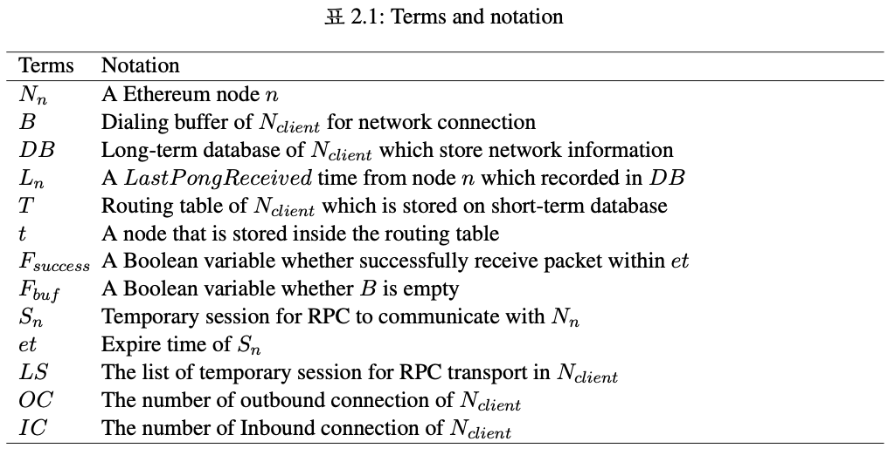 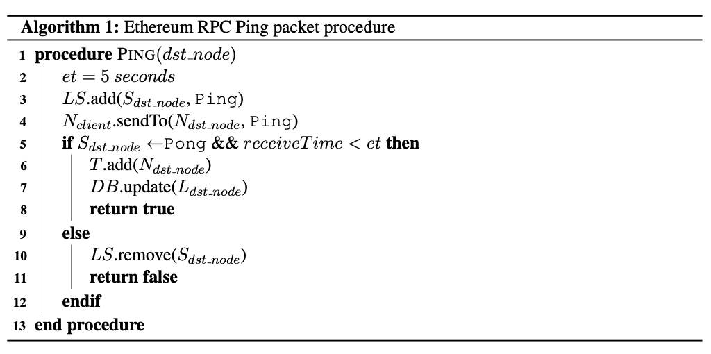
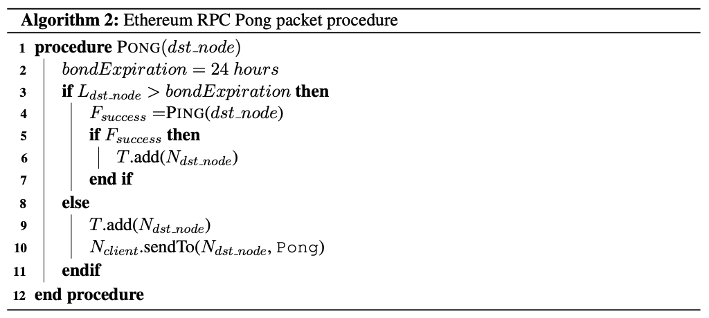 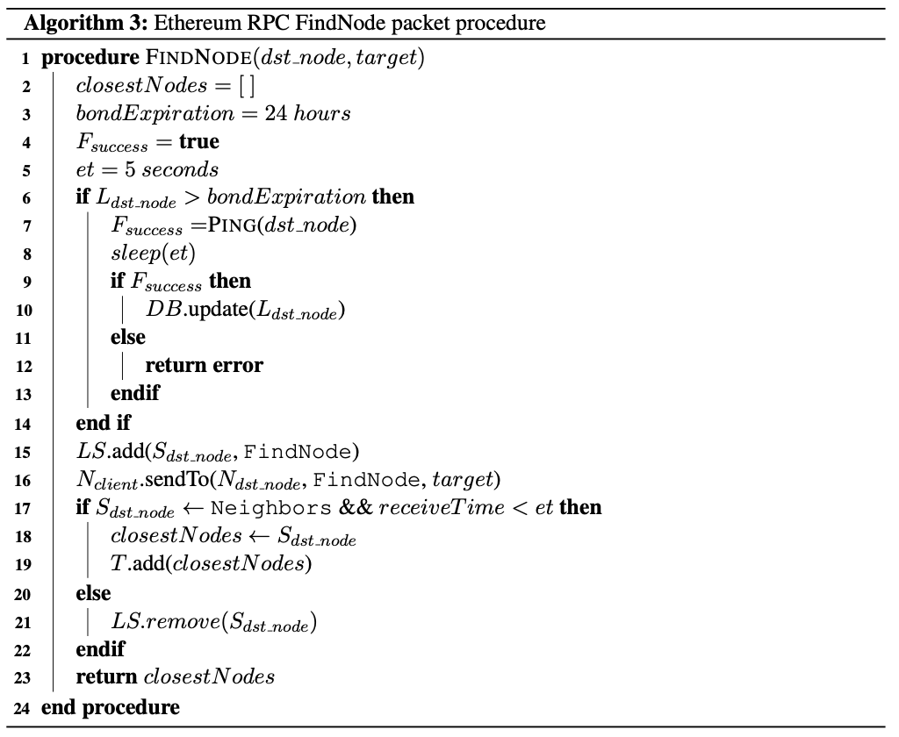
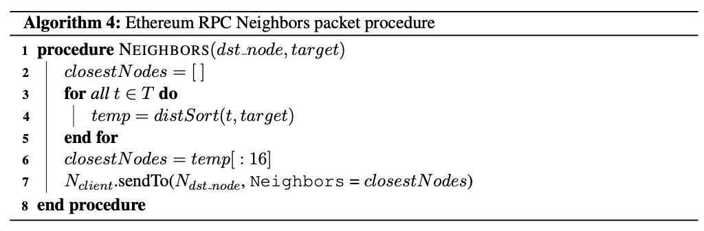

### ✍️ **새로운 이클립스 공격**

 공격 아키텍처 

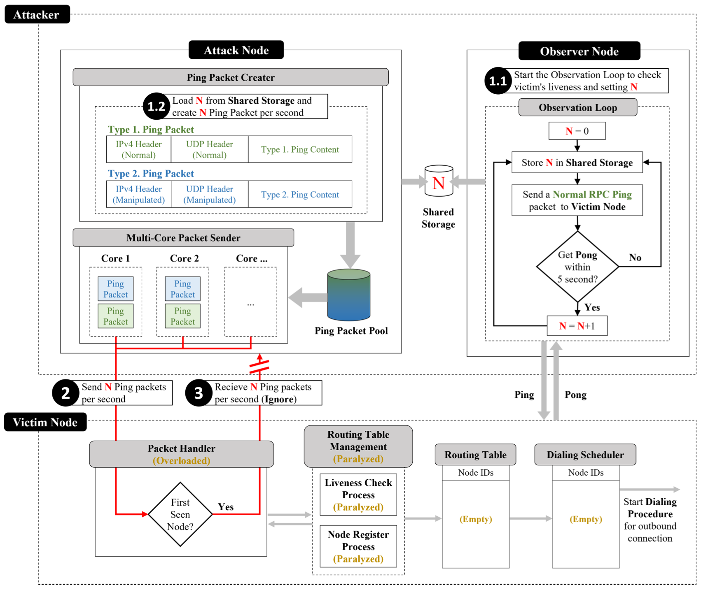

 STEP-1 

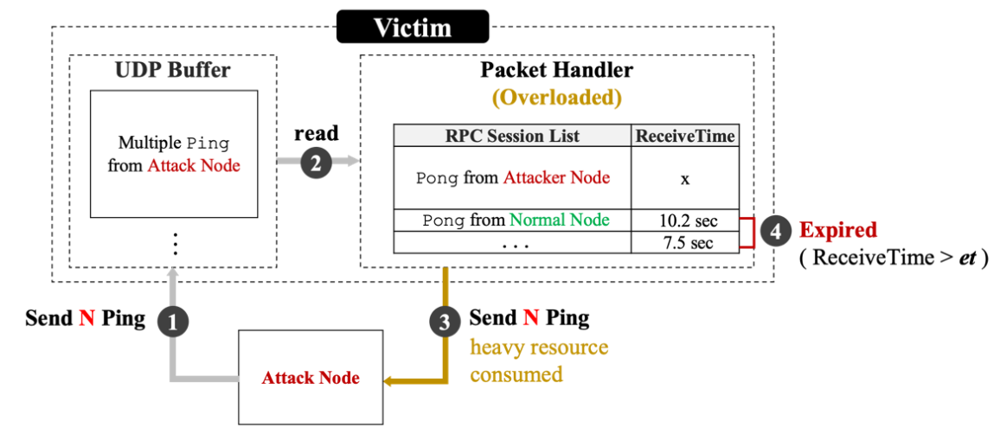

 STEP-2 

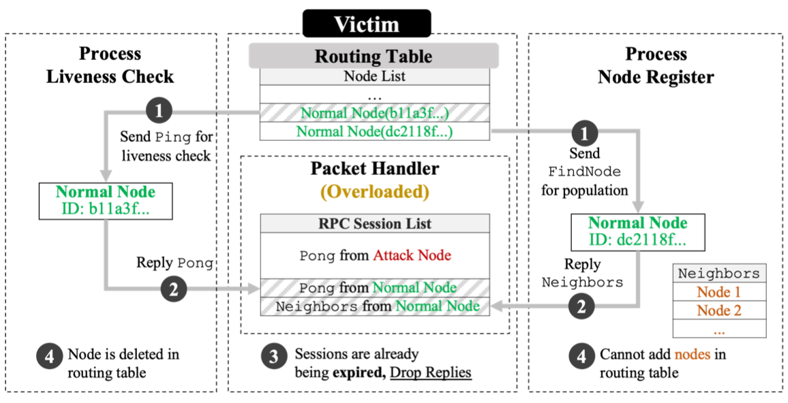

 STEP-3 

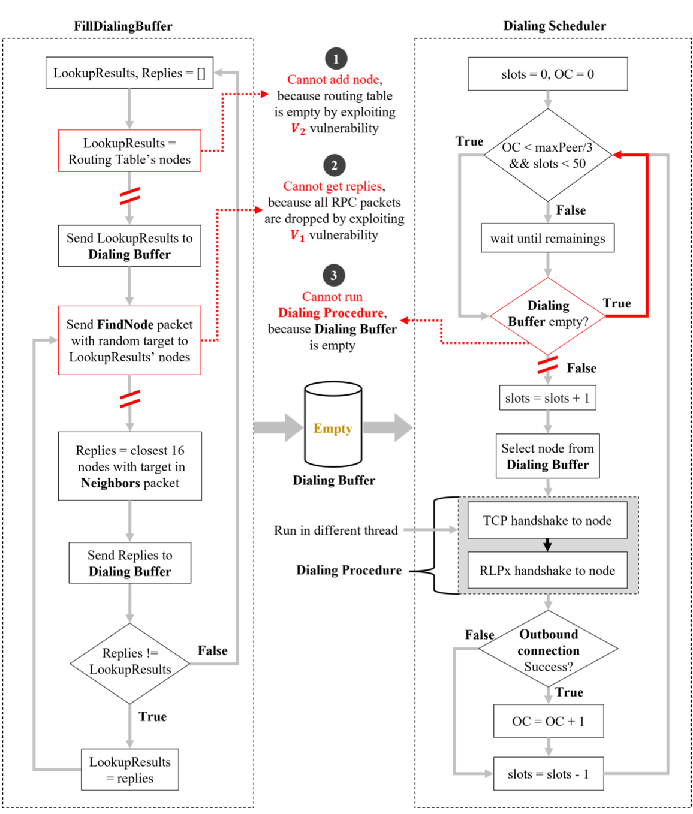

### 📃 **이클립스 공격 실험증명**

* **공격 후, Kademlia DHT 내 노드 개수 감소 실험 증명**
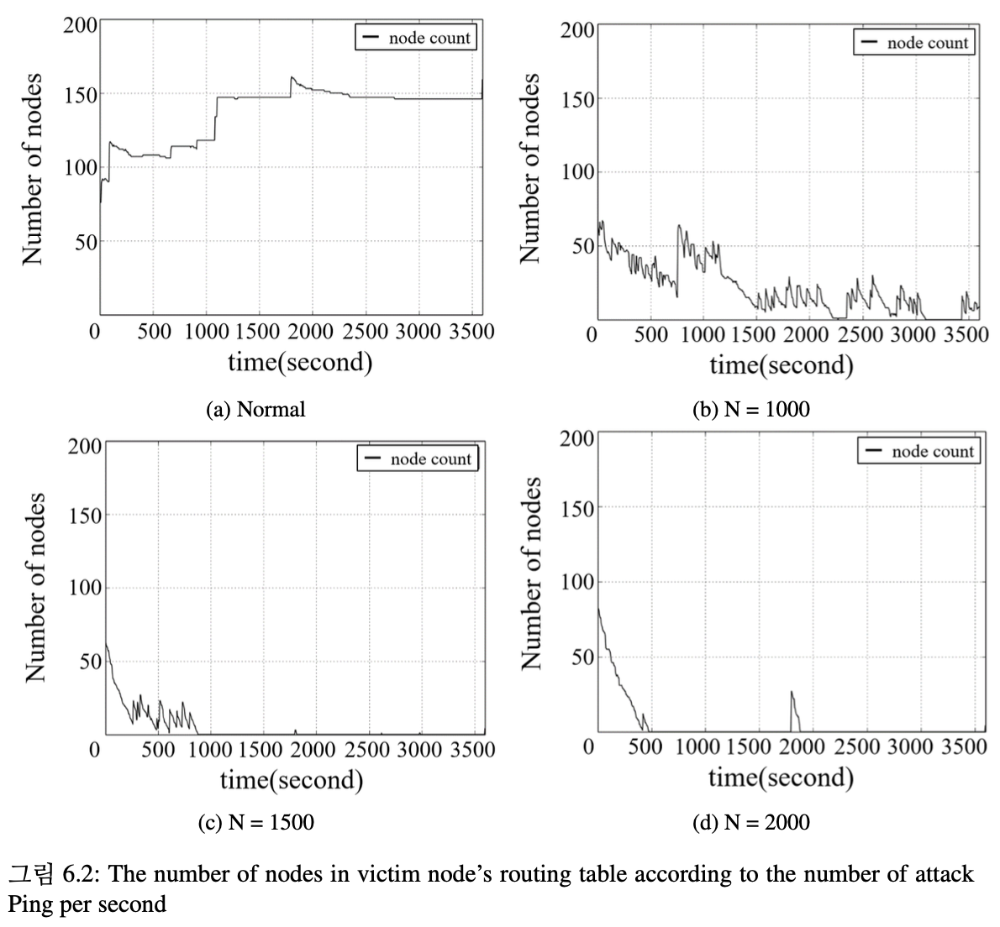

* **공격 후, 노드 연결 시도 횟수 감소 실험 증명**
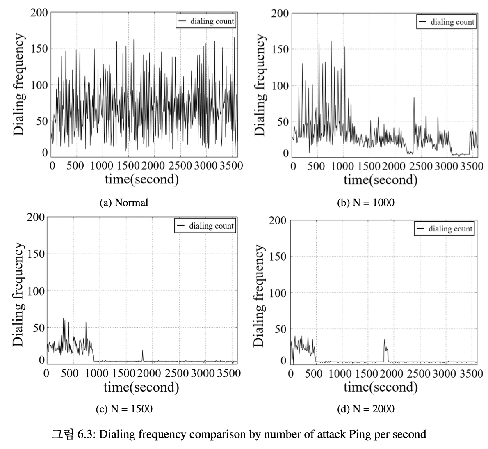

* **공격 후, 연결된 노드 감소 및 블록 동기화 지연 실험 증명**
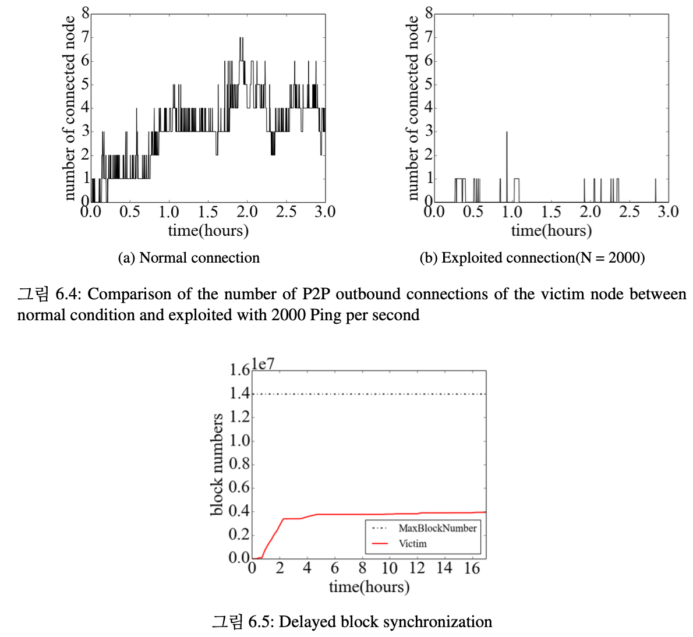