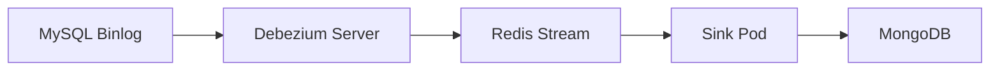
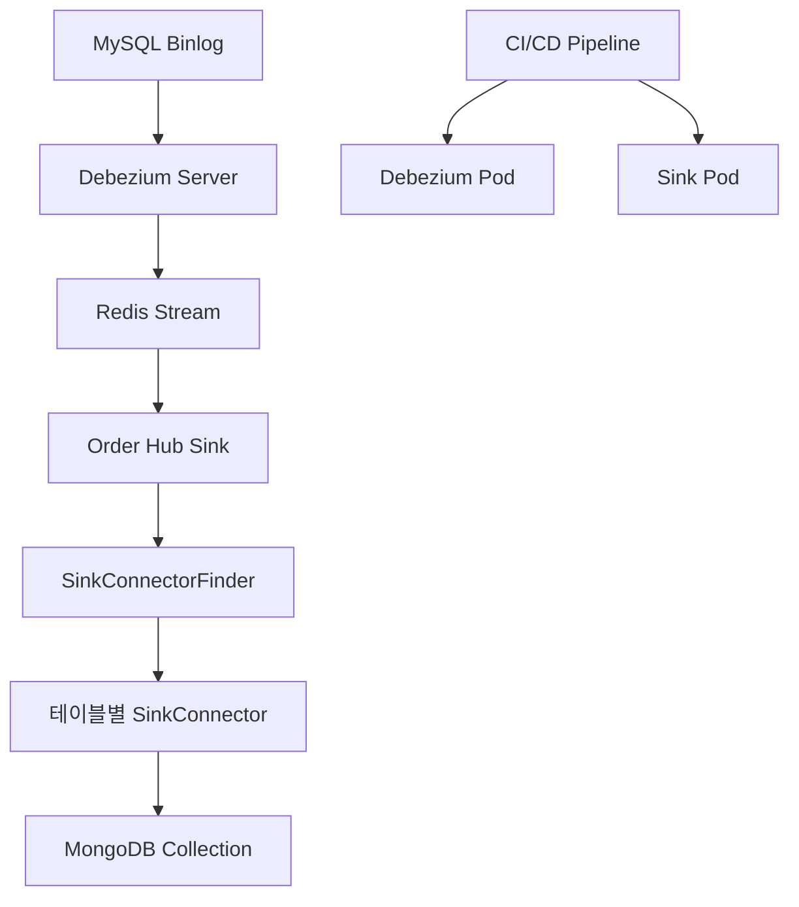

## Table of contents
{: .no_toc .text-delta }

1. TOC
{:toc}

# 1. Intro

기존에 저희는 Mysql 를 main db 로, 멀티프렌차이즈를 목표로 운영하다보니 여러 다양한 스키마들이 필요했고 이를 위한 Mongodb 를 secondary db 로 운영하고 있었습니다. 그리고 신규 피처로 대량의 회원추출을 진행하기 위해 mysql slave 를 보는 것이 아닌, cdc 를 통해서 Mongodb 에 회원정보를 upsert 하는 작업을 진행하고 있습니다. 이 과정에서 여러가지 조건들의 테이블을 단일 docs 로 합치게 된다면 mysql 에서 처럼 join 굳이 안해도 되기때문에 빠르게 조회가 가능해 집니다.

그래서 Debezium server 을 사용하여 Mysql binlog 를 cdc 하고, 이를 Redis Stream 으로 보내고, 별도 sink pod 에서 Redis Stream 해당 토픽 읽고 Mongodb 에 upsert 하는 구조로 진행하고 있습니다. 

| [OLAP](https://en.wikipedia.org/wiki/Online_analytical_processing) 에는 [https://medium.com/@simeon.emanuilov/mongodb-vs-clickhouse-for-olap-1e430a40ade8](https://medium.com/@simeon.emanuilov/mongodb-vs-clickhouse-for-olap-1e430a40ade8) ClickHouse 가 Big Data Query 에 좀 더 좋다고는 하네요. 예로 createdAt 같은 칼럼을 상대로 10월 데이터 조회하면 ClickHouse 가 더 빠르다네요.

이 과정을 정리되지 않은 기록으로 우선 남깁니다.


# 2. Debezium Server CDC 개요

## 2.1. 아키텍처 선택

- **Kafka 없이 일반 Debezium Server로 진행**
    - Reference: [Debezium 3.2 Documentation](https://debezium.io/documentation/reference/3.2/)
    - [Debezium Server Operations](https://debezium.io/documentation/reference/stable/operations/debezium-server.html)

## 2.2. Sink Connector 한계점 및 해결방안

### 문제점 분석
- **Kafka Stream → MongoDB Sink Connector**: ✅ 공식 지원
- **Redis Stream → MongoDB Sink Connector**: ❌ 공식 미지원

### 해결방안
별도의 Sink Pod를 구현하여 Redis Stream 메시지를 읽고 MongoDB에 upsert하는 로직 개발 필요

### 참고 자료
- [카카오페이 MongoDB CDC 구현사례](https://tech.kakaopay.com/post/kakaopaysec-mongodb-cdc/#4-consumer-group-생성-및-offset-설정) - Kafka Sink Connector 사용
- [Debezium Server → Redis Stream 공식 가이드](https://debezium.io/documentation/reference/2.7/operations/debezium-server.html#_redis_stream)
- [PostgreSQL → MongoDB CDC 오픈소스 참고](https://github.com/maqboolthoufeeq/cdc_debezium) - Django 기반 구현체

## 2.3. CDC 프로세스 흐름

### MySQL → Debezium Server → Redis Stream 데이터 플로우



### 1. Snapshots (초기 데이터 로드)
- **기본값**: `initial` 모드
- **동작**: Debezium Server 시작 시 현재 MySQL 상태의 스냅샷 생성
- **모드 옵션**:
  - `initial`: 전체 테이블 스냅샷 후 CDC 시작
  - `recovery`: 이전 오프셋부터 복구
  - `custom`: 사용자 정의 스냅샷
  - `initial_only`: 스냅샷만 수행 후 종료

### 2. 테이블 선택
- **설정**: `table.include.list` 파라미터로 CDC할 테이블 지정
- **형식**: `<database>.<table>` (예: `gyumin.orders,gyumin.users`)

### 3. 실시간 CDC
- MySQL binlog 변경사항을 실시간으로 감지
- Redis Stream에 JSON 형태로 이벤트 전송
## 2.4. CDC 데이터 형태 및 테스트

### 실시간 CDC 테스트 결과
```bash
# INSERT 후 ID 증가 확인
$ redis-cli --json XREVRANGE mysql_sink.gyumin.users + - COUNT 1 | jq -r '.[0][1][1] | fromjson | .payload.after.id'
30001

$ redis-cli --json XREVRANGE mysql_sink.gyumin.users + - COUNT 1 | jq -r '.[0][1][1] | fromjson | .payload.after.id'
30002
```

### 페이로드 구조 분석

#### INSERT 작업 (op: "c")
```json
{
  "payload": {
    "before": null,  // INSERT는 이전 상태 없음
    "after": {
      "id": 30002,
      "name": "테스트용 유저"
      // ... 기타 필드들
    },
    "source": {
      "version": "3.2.0.Final",
      "connector": "mysql",
      "name": "mysql_sink",
      "ts_ms": 1755138551000,
      "snapshot": "false",  // 실시간 CDC (true면 초기 스냅샷)
      "db": "gyumin",
      "table": "users",
      "server_id": 1,
      "gtid": null,
      "file": "binlog.000002",
      "pos": 7114433,
      "row": 0,
      "thread": 385,
      "query": null  // DML에서는 null (DDL에서만 값 존재)
    },
    "transaction": null,
    "op": "c",  // c(insert), u(update), d(delete), r(read), t(truncate)
    "ts_ms": 1755138551799,
    "ts_us": 1755138551799549,
    "ts_ns": 1755138551799549000
  }
}
```
        

### Source 메타데이터 상세 설명

```json
"source": {
  "version": "3.2.0.Final",         // 2025.08.17 기준 stable 최신 버전
  "connector": "mysql",              
  "name": "mysql_sink",              // 커넥터 인스턴스 이름
  "ts_ms": 1755138551000,            // 소스 이벤트 시각(ms), MySQL binlog 타임스탬프 기반
  "snapshot": "false",               // 스냅샷 여부: true(초기 DB 로드), false(실시간 CDC)
  "db": "gyumin",                    // 데이터베이스명
  "sequence": null,                  
  "ts_us": 1755138551000000,         // binlog 이벤트 시간 (마이크로초)
  "ts_ns": 1755138551000000000,      // binlog 이벤트 시간 (나노초)
  "table": "users",                  // CDC 대상 테이블명
  "server_id": 1,                    // MySQL 서버 ID (설정 가능)
  "gtid": null,                      // GTID 모드 사용 시 트랜잭션 GTID (비활성화시 null)
  "file": "binlog.000002",           // 이벤트가 담긴 binlog 파일명
  "pos": 7114433,                    // binlog 파일 내 오프셋 (재시작 시 이 위치부터 CDC 재개)
  "row": 0,                          // 다중 INSERT 시 row 순서 (INSERT VALUES 2개면 row 0, 1)
  "thread": 385,                     // MySQL DB 세션 ID
  "query": null                      // DDL 쿼리 내용 (DML에서는 null)
}
```
    

### UPDATE 작업 페이로드

> **중요**: MySQL에서 `binlog_row_image=FULL` 설정 시 전체 row 변경사항이 기록됩니다. 
> 변경된 부분만이 아닌 전체 row 데이터가 before/after에 포함되어 MongoDB upsert에 최적화되어 있습니다.
> (PostgreSQL의 `wal_level=logical`과 유사)

```json
{
  "payload": {
    "before": {
      "id": 30000,
      "name": "테스트용",
      // ... 전체 필드 (변경 전 상태)
    },
    "after": {
      "id": 30000,
      "name": "테스트용 변경",
      // ... 전체 필드 (변경 후 상태)
    },
    "op": "u"  // update 작업
  }
}
```

### 오프셋 관리 및 모니터링

#### 현재 처리 위치 확인
```bash
# Redis에서 Debezium 오프셋 확인
$ redis-cli HGETALL metadata:debezium:offsets
{
  "ts_sec": 1755155084,
  "file": "binlog.000002",
  "pos": 7117146
}
```
    

## 2.5. 완전한 Debezium Server 설정

> **참고**: [Redis Write-Behind 공식 가이드](https://redis.io/docs/latest/integrate/write-behind/reference/debezium/mysql/)

### 필수 설정 파일 (application.properties)

```properties
# ==========================================
# SINK 설정 (Redis Stream)
# ==========================================
debezium.sink.type=redis
debezium.sink.redis.address=localhost:6379
debezium.sink.redis.db.index=0

# Redis 메모리 제한 및 유량 제어
debezium.sink.redis.memory.limit.mb=512
debezium.sink.redis.memory.threshold.percentage=85

# ==========================================
# SOURCE 설정 (MySQL)
# ==========================================
debezium.source.connector.class=io.debezium.connector.mysql.MySqlConnector

# MySQL 연결 정보
debezium.source.database.hostname=localhost
debezium.source.database.port=3306
debezium.source.database.user=root
debezium.source.database.password=${MYSQL_PASSWORD}
debezium.source.database.dbname=gyumin
debezium.source.database.server.id=111

# 스냅샷 모드
debezium.source.snapshot.mode=initial

# 테이블 선택 (주의: 라인 끝 주석 금지 - Regex 오류 발생)
debezium.source.table.include.list=gyumin.orders,gyumin.users

# ==========================================
# 성능 및 최적화 설정
# ==========================================
# 변경사항 없는 메시지 스킵
debezium.source.skip.messages.without.change=true

# binlog 읽기 주기 (0=즉시, 단위: ms)
debezium.source.offset.flush.interval.ms=1000

# BigDecimal 처리 방식 (정확한 숫자 처리)
debezium.source.decimal.handling.mode=string

# 시간 정밀도 모드
debezium.source.time.precision.mode=adaptive_time_microseconds

# ==========================================
# 스토리지 설정
# ==========================================
# 오프셋 저장소 (Redis 사용)
debezium.source.offset.storage=io.debezium.storage.redis.offset.RedisOffsetBackingStore

# 스키마 히스토리 저장소 (DDL 변경 이력)
debezium.source.schema.history.internal=io.debezium.storage.redis.history.RedisSchemaHistory

# Stream Key 형식: <prefix>.<dbName>.<tableName>
debezium.source.topic.prefix=cdc
```

### 중요 설정 옵션 상세 설명

#### 메모리 관리
- `debezium.sink.redis.memory.limit.mb`: Redis 메모리 사용량 제한
- `debezium.sink.redis.memory.threshold.percentage`: 유량제어 시작 임계값
- **주의사항**: Redis 서버에 `maxmemory` 설정 필요
  ```bash
  redis-cli CONFIG SET maxmemory 4096mb
  redis-cli CONFIG SET maxmemory-policy noeviction
  ```

#### 테이블 및 컬럼 선택
- `table.include.list`: `<DB_NAME>.<TABLE_NAME>` 형식으로 지정
- `column.include.list`: 특정 컬럼만 CDC하고 싶을 때 사용 (현재는 테이블 전체 CDC)

#### 데이터 타입 처리
- `decimal.handling.mode=string`: BigDecimal을 문자열로 처리하여 정밀도 보장
- `time.precision.mode`: 시간 데이터 정밀도 설정

#### MySQL Datetime 처리 가이드

> **참고**: [MySQL Temporal Types 공식 문서](https://debezium.io/documentation/reference/stable/connectors/mysql.html#mysql-temporal-types)

**변환 예시**: `DATETIME` 값 `2018-06-20 06:37:03` → `1529476623000` (밀리초)

**다양한 시간 타입 통합 처리**:
```properties
# 권장: 모든 시간 컬럼을 밀리초로 통일
debezium.source.time.precision.mode=connect
```

**자릿수별 시간 단위 구분법** (2286년까지 유효):
- 1~10자리: 초 단위
- 11~13자리: 밀리초 단위  
- 14~16자리: 마이크로초 단위

## 2.6. 모니터링 및 트러블슈팅

### Redis 메모리 사용량 모니터링
```bash
# Redis 메모리 상태 확인
redis-cli INFO memory

# 특정 Stream 크기 확인
redis-cli XLEN cdc.gyumin.users

# 모든 CDC Stream 목록
redis-cli KEYS "cdc.*"
```

### 일반적인 문제 해결

#### 1. OOM (Out of Memory) 발생
**증상**: Redis 메모리 부족으로 CDC 중단
**원인**: Sink 처리 속도 < Binlog 적재 속도
**해결방법**:
```bash
# 1. Redis 메모리 제한 설정
redis-cli CONFIG SET maxmemory 4096mb
redis-cli CONFIG SET maxmemory-policy noeviction

# 2. Debezium 유량제어 설정 (application.properties)
debezium.sink.redis.memory.limit.mb=512
debezium.sink.redis.memory.threshold.percentage=85
```

#### 2. Binlog 위치 손실
**증상**: Debezium 재시작 시 중복 데이터 또는 누락
**원인**: Redis offset 정보 손실
**해결방법**:
```bash
# 현재 offset 확인
redis-cli HGETALL metadata:debezium:offsets

# 필요시 스냅샷 재실행
debezium.source.snapshot.mode=recovery
```

#### 3. 특정 테이블 CDC 중단
**증상**: 일부 테이블만 CDC 동작 안함
**원인**: DDL 변경 또는 권한 문제
**해결방법**:
```sql
-- MySQL 권한 확인
SHOW GRANTS FOR 'debezium_user'@'%';

-- binlog 상태 확인
SHOW VARIABLES LIKE 'log_bin';
SHOW VARIABLES LIKE 'binlog_format';
SHOW VARIABLES LIKE 'binlog_row_image';
```

# 3. 증분 스냅샷 및 동적 테이블 추가

## 3.1. 증분 스냅샷 개념

운영 중인 CDC 환경에서 새로운 테이블을 추가하거나, 특정 테이블만 초기 데이터를 다시 로드해야 할 때 사용하는 기능입니다.

### 장점
- 전체 CDC 중단 없이 특정 테이블만 스냅샷 가능
- 청크 단위로 분할하여 대용량 테이블 처리 시 부하 분산
- 기존 CDC 작업에 영향 최소화

### 참고 자료
- [Debezium Incremental Snapshots 블로그](https://debezium.io/blog/2021/10/07/incremental-snapshots/)
- [MySQL Connector 증분 스냅샷 가이드](https://debezium.io/documentation/reference/stable/connectors/mysql.html#debezium-mysql-incremental-snapshots)

## 3.2. 시그널 테이블 설정

### 1. 시그널 테이블 생성
```sql
-- 증분 스냅샷 명령용 테이블 생성
CREATE TABLE gyumin.dbz_signal (
  id    VARCHAR(64) PRIMARY KEY,
  type  VARCHAR(32) NOT NULL,
  data  VARCHAR(2048) NULL
);
```

### 2. Debezium 설정 업데이트
```properties
# 기존 테이블 목록에 시그널 테이블과 새 테이블 추가
debezium.source.table.include.list=gyumin.orders,gyumin.users,gyumin.dbz_signal,gyumin.new_table

# 시그널 테이블 지정
debezium.source.signal.data.collection=gyumin.dbz_signal
```

### 3. 증분 스냅샷 실행
```sql
-- 새 테이블(new_table)의 증분 스냅샷 실행
INSERT INTO gyumin.dbz_signal (id, type, data)
VALUES (
   'snapshot-new-table-001',
   'execute-snapshot',
   '{"data-collections":["gyumin.new_table"],"type":"incremental","additional-conditions":{}}'
);
```

## 3.3. 스냅샷 진행 상황 확인

### Redis Stream 생성 확인
```bash
# 새 테이블의 Stream이 생성되었는지 확인
redis-cli KEYS "cdc.gyumin.new_table"

# Stream 내 데이터 개수 확인
redis-cli XLEN cdc.gyumin.new_table

# 샘플 데이터 확인
redis-cli XRANGE cdc.gyumin.new_table - + COUNT 5
```

### 스냅샷 완료 확인
```bash
# 스냅샷 완료 시그널 확인 (type: snapshot-completed)
redis-cli XREVRANGE cdc.gyumin.dbz_signal + - COUNT 10
```

### Mysql datetime to millis 알고있어야함.

> reference : https://debezium.io/documentation/reference/stable/connectors/mysql.html#mysql-temporal-types
`DATETIME` with a value of `2018-06-20 06:37:03` becomes `1529476623000`.

정상동작 확인되었으니 해당 건 도커라이징 후 외부 환경변수 secret 세팅과 pod 로 로드하는 cicd 파이프라인 및 모니터링 설정 필요!

## 3.5. CDC 안정화 및 성능 최적화

### 필수 안정화 설정

#### 1. Redis Connection Timeout 설정
```properties
# Redis 명령 타임아웃 > XGROUPREAD pollTimeout 설정 필수
debezium.sink.redis.connection.timeout.ms=30000
debezium.sink.redis.socket.timeout.ms=30000

# Stream 읽기 타임아웃 (위 값보다 작게 설정)
redis.stream.poll.timeout.ms=25000
```

#### 2. 장애 복구 전략
**문제**: Sink 실패 시 메시지 재처리 중 데이터 순서 문제
- A → B → C 순서로 업데이트되어야 하는데
- A 실패 → B 성공 → C 성공 후 A 재처리 시 최신 데이터 덮어쓰기 위험

**해결 방안**:
```kotlin
// 재처리 시 타임스탬프 비교로 순서 보장
fun shouldProcessPendingMessage(pendingMsg: DebeziumMessage, currentRow: SinkDocument?): Boolean {
    if (currentRow == null) return true
    
    val pendingTimestamp = pendingMsg.payload.ts_ms
    val currentTimestamp = currentRow.sinkInfo.sinkedAt
    
    // 재처리 메시지가 현재 저장된 데이터보다 오래된 경우 무시
    return pendingTimestamp > currentTimestamp
}
```

#### 3. 소프트 삭제 정책 활용
- 프로젝트 기본 정책: 소프트 삭제 (Hard Delete 없음)
- 삭제 시점 추적으로 재처리 순서 보장 가능

# 4. Sink (CDC + ETL) 데이터 적재 모듈

## 4.1. 전체 아키텍처

### 데이터 플로우


### 모듈 구성 요소
1. **CDC 모듈** (Debezium Server): MySQL → Redis Stream
2. **ETL 모듈** (Order Hub Sink): Redis Stream → MongoDB
3. **CI/CD 파이프라인**: 모듈별 독립 배포

## 4.2. 상세 구현 가이드

### 1) CI/CD 및 배포 전략

**배포 아키텍처**:
- 기존 프렌차이즈별 수동 배포에 공통 모듈 배포 추가
- Debezium, Sink 모듈 각각 독립적인 CI/CD 파이프라인
- 환경변수는 `deploy.yaml`의 envset으로 Linux 환경변수 주입

**주요 파라미터**:
- Database 연결 정보 (MySQL, MongoDB, Redis)
- Quarkus 런타임 설정
- 메모리 및 성능 튜닝 파라미터

### 2) Debezium Server CDC
- **역할**: MySQL Binlog → Redis Stream JSON 변환
- **배포**: 독립적인 Pod로 실행
- **모니터링**: Redis Stream 메모리 사용량, Binlog 지연 시간

### 3) ETL 모듈 (Sink) 상세 구현

#### Row 데이터 클래스 (MySQL 스키마 매핑)
```kotlin
// 위치: order-hub-sink/src/main/kotlin/.../connector/<domain>/
@JsonIgnoreProperties(ignoreUnknown = true)
data class OrderRow(
    val id: Long?,
    val franchiseCode: String?,
    val orderStatus: String?,
    val createdAt: String?,  // Debezium 타임스탬프 문자열
    val updatedAt: String?,
    // ... 가능한 모든 필드 null 허용 (DDL 변경 대응)
)
```

#### MongoDB 도메인 문서 클래스
```kotlin
// 위치: order-hub/src/main/kotlin/.../domain/sink/<domain>/
@Document(collection = "sink_orders")
data class SinkOrder(
    @Id val mongoId: String = ObjectId().toString(),
    val orderId: Long,
    val franchiseCode: String,
    val orderStatus: String,
    val items: List<SinkOrderItem> = emptyList(),  // 비정규화
    val sinkInfo: SinkInfo,  // 메타데이터
    val createdAt: OffsetDateTime,
    val updatedAt: OffsetDateTime
) : SinkClass

data class SinkInfo(
    val mysqlId: Long,           // MySQL PK
    val franchiseCode: String,   // 멀티 프렌차이즈 격리
    val sinkedAt: OffsetDateTime // CDC 처리 시점
)
```

#### SinkConnector 구현
```kotlin
@Component
class OrderSinkConnector(
    private val mongoTemplate: MongoTemplate
) : SinkConnector<OrderRow, SinkOrder>() {
    
    override val typeRef = object : TypeReference<DebeziumMessage<OrderRow>>() {}
    override val mysqlTableName = "orders"
    override val collectionName = "sink_orders"
    
    override fun toEntity(row: OrderRow, franchise: String): SinkOrder {
        return SinkOrder(
            orderId = row.id!!,
            franchiseCode = franchise,
            orderStatus = row.orderStatus!!,
            sinkInfo = SinkInfo(
                mysqlId = row.id!!,
                franchiseCode = franchise,
                sinkedAt = OffsetDateTime.now()
            ),
            createdAt = parseDebeziumTimestamp(row.createdAt!!),
            updatedAt = parseDebeziumTimestamp(row.updatedAt!!)
        )
    }
    
    override fun keyQuery(row: OrderRow, franchise: String): Query {
        return Query(
            Criteria.where("sinkInfo.mysqlId").`is`(row.id)
                .and("sinkInfo.franchiseCode").`is`(franchise)
        )
    }
}
```

#### SinkConnector 베이스 클래스
```kotlin
abstract class SinkConnector<T, E : SinkClass>(
    protected val mongoTemplate: MongoTemplate
) {
    abstract val typeRef: TypeReference<DebeziumMessage<T>>
    abstract val mysqlTableName: String
    abstract val collectionName: String
    
    // 단건 처리
    fun handle(message: DebeziumMessage<T>) {
        when (message.payload.op) {
            "c", "r", "u" -> upsertDocument(message)
            "d" -> deleteDocument(message)
        }
    }
    
    // 벌크 처리 (성능 최적화)
    fun bulkHandle(messages: List<DebeziumMessage<T>>) {
        val operations = messages.map { createBulkOperation(it) }
        mongoTemplate.bulkOps(BulkOperations.BulkMode.UNORDERED, collectionName)
            .apply { operations.forEach { execute() } }
    }
    
    abstract fun toEntity(row: T, franchise: String): E
    abstract fun keyQuery(row: T, franchise: String): Query
}
```

### 4) 자동 라우팅 및 테스트

#### SinkConnectorFinder (자동 라우팅)
```kotlin
@Component
class SinkConnectorFinder(connectors: List<SinkConnector<*, *>>) {
    private val connectorMap = connectors.associateBy { it.mysqlTableName }
    
    fun findConnector(tableName: String): SinkConnector<*, *>? {
        return connectorMap[tableName]
    }
}
```

#### 종합 테스트 (Kotest + Testcontainers)
```kotlin
class OrderSinkConnectorTest : StringSpec({
    
    "CDC INSERT 메시지 처리 테스트" {
        // Given
        val debeziumMessage = DebeziumMessage(
            payload = Payload(
                op = "c",
                after = OrderRow(id = 1L, franchiseCode = "TEST"),
                before = null
            )
        )
        
        // When
        connector.handle(debeziumMessage)
        
        // Then
        val result = mongoTemplate.findOne(
            Query(Criteria.where("sinkInfo.mysqlId").`is`(1L)),
            SinkOrder::class.java
        )
        result shouldNotBe null
        result!!.franchiseCode shouldBe "TEST"
    }
    
    "멀티 프랜차이즈 격리 테스트" {
        // 동일한 MySQL ID라도 프랜차이즈별 별도 저장 확인
    }
    
    "벌크 처리 성능 테스트" {
        // 100개 메시지 벌크 처리 vs 단건 처리 성능 비교
    }
})
```

### 5) 실제 운영 플로우
1. **Stream 구독**: SinkBindingsConfig에서 `cdc.*` prefix 동적 감지
2. **메시지 라우팅**: 테이블명 기반 자동 커넥터 선택  
3. **변환 및 저장**: Row → 도메인 문서 매핑 후 MongoDB upsert/remove
4. **멀티 프랜차이즈**: `franchiseCode + mysqlId` 조합으로 격리 저장

# 5. 운영 중 발생한 핵심 이슈 및 해결방안

## 5.1. Redis OOM 문제 및 유량제어

### 문제 상황
- **증상**: Redis 메모리 부족으로 CDC 전체 중단
- **원인**: Sink 처리 속도 << Binlog 적재 속도
- **영향도**: 전체 CDC 파이프라인 중단

### 해결 과정
```bash
# 1단계: Redis 메모리 제한 설정
redis-cli CONFIG SET maxmemory 4096mb
redis-cli CONFIG SET maxmemory-policy noeviction

# 2단계: Debezium 유량제어 (application.properties)
debezium.sink.redis.memory.limit.mb=512
debezium.sink.redis.memory.threshold.percentage=85
```

### 결과 모니터링

- **개선 전**: 4GB 메모리 사용 → 키 제거 발생
- **개선 후**: 400MB 대 안정적 유지

### 중요 포인트
- Redis `maxmemory=0` (unlimited) 상태에서는 Debezium 유량제어 옵션이 무시됩니다.
- 반드시 Redis 메모리 제한을 먼저 설정한 후 Debezium 옵션 적용 필요

## 5.2. 동적 Stream 관리

### 기존 문제점
- 하드코딩된 Stream 목록으로 신규 테이블 추가 시 배포 필요
- 운영 중 테이블 추가/제거의 유연성 부족

### 개선 방안
```kotlin
@Scheduled(fixedRate = 1000) // 1초마다 실행
fun discoverNewStreams() {
    val existingStreams = redisTemplate.keys("cdc.*")
    val activeConnections = inMemoryStreamConnections
    
    // 신규 Stream 감지 및 연결
    existingStreams.subtract(activeConnections).forEach { streamKey ->
        connectToStream(streamKey)
        log.info("새로운 CDC Stream 연결: $streamKey")
    }
}
```

### 운영 효과
- 배포 없이 실시간 테이블 추가 가능
- 인메모리 연결 관리로 성능 최적화
- 장애 시 자동 복구 가능

## 5.3. 성능 최적화: 단건 → 벌크 처리

### 성능 분석 결과
- **기존**: 단건 처리 평균 1.3~1.5ms
- **개선**: 벌크 처리 100건당 평균 27ms (건당 0.27ms)
- **성능 향상**: **약 5배 개선**

### 벌크 처리 구현
```kotlin
@Component
class BulkSinkProcessor {
    private val messageBuffer = mutableListOf<DebeziumMessage<*>>()
    private val bufferSize = 100
    
    fun addMessage(message: DebeziumMessage<*>) {
        messageBuffer.add(message)
        
        if (messageBuffer.size >= bufferSize) {
            flushBuffer()
        }
    }
    
    @Scheduled(fixedRate = 1000) // 1초마다 강제 flush
    fun scheduledFlush() {
        if (messageBuffer.isNotEmpty()) {
            flushBuffer()
        }
    }
    
    private fun flushBuffer() {
        val messages = messageBuffer.toList()
        messageBuffer.clear()
        
        // 테이블별 그룹핑 후 벌크 처리
        messages.groupBy { it.payload.source.table }
            .forEach { (table, msgs) ->
                sinkConnectorFinder.findConnector(table)
                    ?.bulkHandle(msgs)
            }
            
        // Redis Stream에서 벌크 ACK & DELETE
        redisTemplate.execute { connection ->
            connection.xAck(streamKey, consumerGroup, *messageIds)
            connection.xDel(streamKey, *messageIds)
        }
    }
}
```

### 실제 성능 로그
```
2025-09-26T02:48:01.890+09:00  INFO [fooddash-domain] [virtual-246] 
SinkConnector: bulkHandle called with 100 records for table menus
SinkConnector.bulkHandle(..) 실행 시간: 26.672 ms

2025-09-26T02:48:01.926+09:00  INFO [fooddash-domain] [MessageBroker-2]
SinkConnector: bulkHandle called with 12 records for table menus  
SinkConnector.bulkHandle(..) 실행 시간: 4.947 ms
```

### 최적화 포인트
1. **네트워크 라운드트립 감소**: 100개 → 1번의 MongoDB 연결
2. **Redis 운영 최적화**: 벌크 ACK/DELETE로 메모리 효율성 향상
3. **버퍼링 전략**: 크기 기반 + 시간 기반 이중 flush 전략

## 5.4. 데이터 정합성 및 안정성 보장

### 데이터 유실 방지 전략
- **Redis 정책**: `noeviction` 설정으로 데이터 보호
- **유량제어**: MySQL → Redis 적재 속도 조절
- **오프셋 관리**: Redis에 binlog position 지속적 저장
- **멱등성**: 재처리 시 중복 처리 방지

### 재시작 시 복구 전략
```bash
# Debezium Server 재시작 시
# 1. Redis에서 마지막 처리 오프셋 확인
redis-cli HGETALL metadata:debezium:offsets

# 2. 해당 binlog position부터 CDC 재개
# 3. 멱등성 보장으로 중복 처리 안전
```

### 최악의 시나리오 대응
```properties
# binlog offset 완전 손실 시 전체 스냅샷 재실행
debezium.source.snapshot.mode=initial

# 데이터 무결성 검증
debezium.source.snapshot.include.collection.list=gyumin.critical_tables
```

# 6. Best Practices 및 운영 가이드

## 6.1. 새로운 테이블 추가 체크리스트

### 개발 단계
- [ ] **1. Row 데이터 클래스 생성**
  ```kotlin
  // snake_case, 모든 필드 null 허용, BigDecimal/OffsetDateTime 적절히 사용
  data class NewTableRow(
      val id: Long?,
      val name: String?,
      val created_at: String?  // Debezium 형식
  )
  ```

- [ ] **2. MongoDB 도메인 문서 클래스**
  ```kotlin
  @Document(collection = "sink_new_table")
  data class SinkNewTable(...) : SinkClass
  ```

- [ ] **3. SinkConnector 구현**
  ```kotlin
  @Component
  class NewTableSinkConnector : SinkConnector<NewTableRow, SinkNewTable>
  ```

### 운영 단계  
- [ ] **4. 증분 스냅샷 고려사항**
  - 기존 데이터 로드 필요 여부 판단
  - 대용량 테이블인 경우 청크 크기 조절
  
- [ ] **5. 테스트 작성**
  ```kotlin
  // Kotest + Testcontainers
  // c/u/d 모든 케이스, 멀티 프렌차이즈, 엣지 케이스 검증
  ```

- [ ] **6. 모니터링 설정**
  - Stream 크기 모니터링
  - 처리 지연 시간 확인
  - 에러율 추적

### 비정규화 테이블 특별 고려사항
```kotlin
// OrderItem처럼 부모 문서 내 배열로 저장되는 경우
override fun bulkHandle(messages: List<DebeziumMessage<OrderItemRow>>) {
    // 개별 upsert 필요 (안전한 필드 단위 .set 사용)
    messages.forEach { msg ->
        val updateOps = Update()
            .set("items.$.itemName", msg.payload.after.itemName)
            .set("items.$.updatedAt", OffsetDateTime.now())
            
        mongoTemplate.updateFirst(
            Query(Criteria.where("items.itemId").`is`(msg.payload.after.id)),
            updateOps,
            collectionName
        )
    }
}
```

## 6.2. 운영 중 필수 모니터링 지표

### Redis 메트릭
```bash
# 주요 모니터링 명령어
redis-cli INFO memory | grep used_memory_human
redis-cli XLEN cdc.gyumin.orders
redis-cli XINFO GROUPS cdc.gyumin.orders
```

### 성능 지표
- **Stream 적재 속도**: messages/sec
- **Sink 처리 속도**: documents/sec  
- **지연 시간**: binlog timestamp vs processed timestamp
- **에러율**: failed messages / total messages

### 알림 설정 권장사항
```yaml
# 예시: Prometheus + Grafana 알림
- alert: RedisStreamLag
  expr: redis_stream_length > 10000
  for: 5m
  
- alert: SinkProcessingDelay  
  expr: cdc_processing_delay_seconds > 300
  for: 2m
```

## 6.3. application.properties 설정 규칙

### 필수 준수 사항
```properties
# ❌ 라인 끝 주석 금지 (Regex 파싱 오류)
debezium.source.table.include.list=gyumin.orders,gyumin.users # 이렇게 하면 안됨

# ✅ 올바른 형식
debezium.source.table.include.list=gyumin.orders,gyumin.users

# ✅ BigDecimal 정확도 보장
debezium.source.decimal.handling.mode=string

# ✅ 테이블 지정 형식
# <SCHEMA_NAME>.<TABLE_NAME> 형식 준수
```

### 환경별 설정 분리
```properties
# Base: application.properties
debezium.source.database.hostname=${MYSQL_HOST:localhost}
debezium.source.database.password=${MYSQL_PASSWORD}

# 환경별 오버라이드
# application-dev.properties, application-prod.properties
```

# 7. Datetime 처리 및 데이터 타입 최적화

## 7.1. Debezium 시간 타입 변환 상세

### MySQL 시간 컬럼별 Debezium 변환 결과


팀에서 `datetime(2)`, `datetime`, `timestamp` 등 다양한 시간 타입을 사용하고 있어, 이를 통합 처리하는 전략이 필요했습니다.

### 현재 사용 중인 적응형 변환 로직
```kotlin
fun parseDebeziumTimestamp(value: Long): OffsetDateTime {
    val absValue = kotlin.math.abs(value)
    
    return when {
        absValue <= 9999999999L -> {
            // 1~10자리: 초 단위 (1653년~2286년)
            Instant.ofEpochSecond(value).atOffset(ZoneOffset.UTC)
        }
        absValue <= 9999999999999L -> {
            // 11~13자리: 밀리초 단위
            Instant.ofEpochMilli(value).atOffset(ZoneOffset.UTC)
        }
        else -> {
            // 14~16자리: 마이크로초 단위  
            val seconds = value / 1_000_000
            val nanos = (value % 1_000_000) * 1000
            Instant.ofEpochSecond(seconds, nanos).atOffset(ZoneOffset.UTC)
        }
    }
}
```

### 한계점 및 극단값 처리
- **2280년 문제**: 자릿수 구분법의 유효 기간
- **9999년 12월 31일**: 실제 사용 중인 극단값
- **1970년 이전 데이터**: 음수 타임스탬프 처리

### 권장 해결책: 시간 타입 표준화
```properties
# 모든 시간 컬럼을 밀리초로 통일
debezium.source.time.precision.mode=connect

# MySQL DDL 표준화
ALTER TABLE orders MODIFY created_at DATETIME(3);
ALTER TABLE orders MODIFY updated_at DATETIME(3);
```

이렇게 하면 모든 시간 데이터가 밀리초 단위로 통일되어 변환 로직이 단순해집니다.

# 8. 운영 규칙 및 정책

## 8.1. 데이터 Sink 정책

### sinkedAt 기준 처리 규칙
```kotlin
/**
 * sinkedAt은 binlog event 발생 시점을 의미
 * 기존 문서보다 이전 시점의 데이터가 도착해도 그대로 sink 수행
 * 이유: SELECT 쿼리 네트워크 비용 절약
 */
override fun shouldSkipOldData(newData: DebeziumMessage<T>): Boolean {
    // 현재는 타임스탬프 비교 없이 모든 데이터 처리
    return false
}
```

### 재시도 정책
- **1회 재시도**: Sink 실패 시 1회에 한해 재시도
- **최종 처리**: 재시도 성공 여부와 관계없이 Pending & Stream에서 제거
- **데이터 정정**: 정확한 데이터 필요 시 별도 재처리 전략 수립 필요

### 메모리 관리
- **Stream 정리**: Sink 성공 시 즉시 Stream에서 제거하여 메모리 확보
- **Pending 관리**: 실패 메시지는 PEL(Pending Entries List)에서 관리

## 8.2. 비정규화 전략

### Order ↔ OrderItem 관계 처리
```kotlin
/**
 * Order 문서에 OrderItem을 배열로 포함하는 비정규화 구조
 * 주의사항: OrderItem이 Order보다 먼저 생성될 수 있음
 */
@Document(collection = "sink_orders")
data class SinkOrder(
    val orderId: Long,
    val items: List<SinkOrderItem> = emptyList(),  // 비정규화된 주문 아이템들
    // ...
)

// OrderItem CDC 처리 시 부모 Order 문서 존재 여부 확인 필요
```

### 처리 순서 고려사항
1. **OrderItem 먼저 도착**: 임시 Order 문서 생성 후 Item 추가
2. **Order 나중 도착**: 기존 Order 문서 업데이트 및 Item 병합
3. **동시 처리**: 트랜잭션 또는 Lock을 통한 일관성 보장

## 8.3. 스키마 진화 대응

### Row 데이터 클래스 설계 원칙
```kotlin
/**
 * RDBMS DDL 변경에 유연하게 대응하기 위한 설계
 * 모든 필드를 null 허용으로 선언
 */
@JsonIgnoreProperties(ignoreUnknown = true)  // 신규 필드 무시
data class FlexibleRow(
    val id: Long?,                    // PK도 null 허용 (DDL 변경 대비)
    val name: String?,                // 모든 필드 nullable
    val newField: String? = null,     // 신규 필드는 기본값과 함께
    val deprecatedField: String?      // 제거 예정 필드도 유지
)
```

### DDL 변경 시 대응 절차
1. **Row 클래스 업데이트**: 신규 필드 추가 (nullable)
2. **Entity 클래스 업데이트**: MongoDB 스키마 반영  
3. **SinkConnector 로직 수정**: 변환 로직 업데이트
4. **테스트 추가**: 신규 필드 처리 검증
5. **점진적 배포**: Canary 배포로 안전성 확인

# 9. 마무리 및 다음 단계

## 9.1. 현재 구현 완료 사항
- ✅ **CDC 파이프라인**: MySQL → Debezium → Redis Stream → MongoDB
- ✅ **성능 최적화**: 벌크 처리로 5배 성능 향상  
- ✅ **메모리 관리**: Redis OOM 방지 및 유량제어
- ✅ **동적 스케일링**: 실시간 테이블 추가 지원
- ✅ **테스트 커버리지**: Kotest + Testcontainers 종합 테스트
- ✅ **모니터링**: 운영 지표 및 알림 체계

## 9.2. 향후 개선 과제

### 고가용성 (High Availability)
- [ ] Debezium Server 다중화 (Active-Standby)
- [ ] Redis Cluster 구성으로 SPOF 제거
- [ ] MongoDB Replica Set 연동

### 스케일링 대응
- [ ] Sink Pod 수평 확장 (Stream 파티셔닝)
- [ ] 테이블별 독립적인 CDC 파이프라인
- [ ] 대용량 테이블 청크 분할 처리

### 운영 자동화
- [ ] 장애 자동 복구 시스템
- [ ] 데이터 품질 모니터링
- [ ] 성능 튜닝 자동화

### 데이터 거버넌스
- [ ] 데이터 계보 추적 (Data Lineage)
- [ ] GDPR 대응 (개인정보 마스킹)
- [ ] 감사 로그 체계

## 9.3. 운영팀 인수인계 사항

### 일상 운영 체크리스트
- [ ] **매일**: Redis 메모리 사용량 확인
- [ ] **매일**: Stream 지연 시간 모니터링  
- [ ] **주간**: Sink 에러율 분석
- [ ] **월간**: 성능 트렌드 리뷰

### 장애 대응 절차서
1. **CDC 중단 시**: binlog position 확인 → Debezium 재시작
2. **Redis OOM 시**: 메모리 정책 확인 → 유량제어 조정
3. **Sink 지연 시**: 벌크 처리 크기 조정 → Pod 스케일링

### 문의 연락처 및 문서
- **기술 문의**: [담당자 Slack 채널]
- **장애 대응**: [On-call 순번표]
- **상세 문서**: [Confluence 링크]

---

**최종 업데이트**: 2025-09-26  
**문서 버전**: v2.0  
**작성자**: [Your Name]

