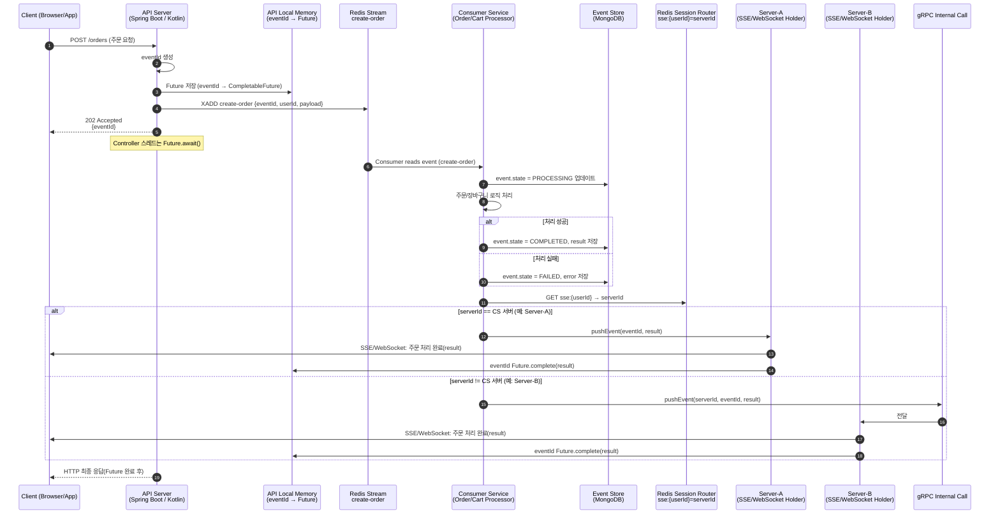

교촌, 자담 등 여러 프랜차이즈 서비스를 운영하다 보면,
각 프로젝트에서 공통으로 사용하는 코드(도메인, 유틸, 설정 등) 가 생깁니다.

그래서 저희 팀은 하나의 저장소 안에 여러 브랜드의 모듈을 함께 관리하는 구조로 시작했습니다.

```bash
server-repo/             # 저장소 루트
├─ domain/                      # 공통 도메인 모듈
│  └─ 여러 공통 도메인 클래스들
├─ service-kyochon/             # 교촌 서비스 모듈
│  ├─ user/
│  ├─ external/
│  └─ admin/
├─ service-jadam/               # 자담 서비스 모듈
│  ├─ user/
│  ├─ external/
│  └─ admin/
```

이 구조에서는 domain 모듈을 공통으로 참조해
각 서비스가 동일한 도메인 로직을 쉽게 재사용할 수 있습니다.

--------

**하지만, "레포를 나누거나 다른 레포에서 해당 모듈 사용" 시점에서 문제가 발생합니다**

처음에는 monorepo 형태로 관리하기 편하지만,
브랜드별 레포지토리를 분리해야 하는 시점이 오면 문제가 생깁니다.

* 공통 모듈(domain)을 복사해야 함
* 각 프로젝트에서 버전 관리가 따로 이루어짐
* 수정 내용이 서로 다른 저장소에 중복 반영됨

결국 코드가 중복되고,
"어느 버전이 최신인지" 관리하기 어려운 상황이 발생합니다 ㅜㅜ.

--------

그래서 선택한 방법은? **GitHub Packages** !

공통 모듈을 GitHub Packages로 배포하여 따로 **버전 관리**할 수 있고 각 서비스에서 버전만 지정해 쉽게 사용 할 수 있습니다.

[https://github.com/ghkdqhrbals/personal-module](https://github.com/ghkdqhrbals/personal-module)

* github-actions 로 pr 테스트 결과 코멘트 및 수동 publish 가능하도록 설정


* 배포완료 시 tagging + release + slack alert


이렇게 하면 각 서비스 프로젝트에서는 단순히 아래처럼 의존성만 추가하면 됩니다.

```
repositories {
    mavenCentral()
    maven {
        url = uri("https://maven.pkg.github.com/ghkdqhrbals/personal-module")
        credentials {
            username = "<github_username>"
            password = "<personal_access_token>"
        }
    }
}

dependencies {
    implementation("com.github.ghkdqhrbals:personal-module:0.2.0")
}
```

이제 각 프랜차이즈 서비스는 domain이나 common-module을 직접 포함하지 않고도,
필요한 공통 기능만 명확히 버전으로 관리하면서 사용할 수 있습니다.
덕분에 코드 중복이 줄고, 모듈별 독립성도 강화되었습니다!


