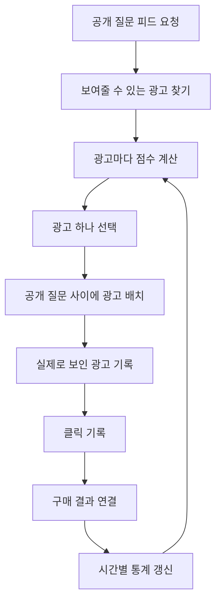
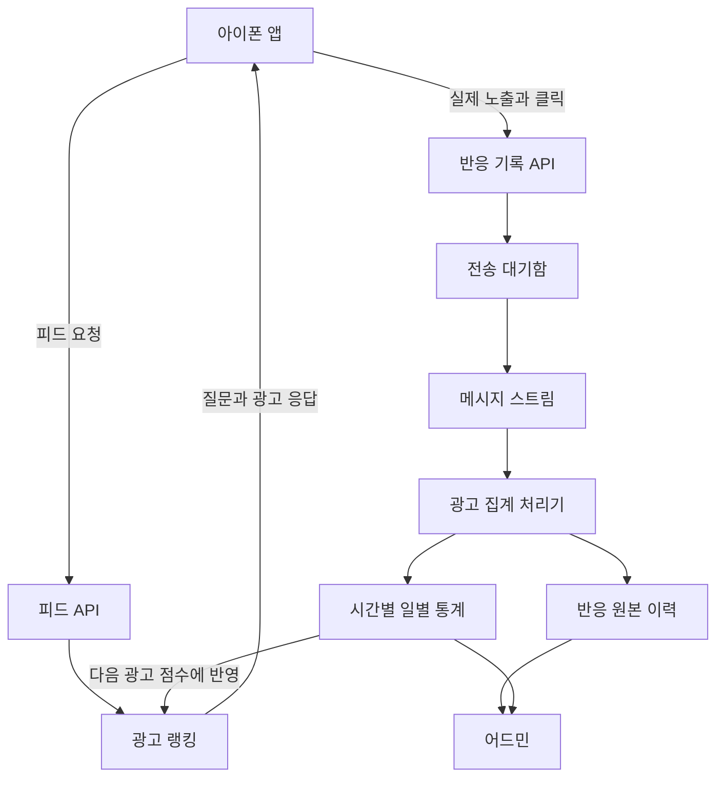

# 왜 이 기능이 필요했을까?

BuddyStudy의 공개 질문 사이에 광고를 자연스럽게 섞어서 보여주려고 한다.

처음에는 관리자가 등록한 광고를 랜덤하게 하나 골라서 보여주면 된다고 생각했다. 구현도 쉽고 광고마다 비슷한 기회를 줄 수 있기 때문이다.

그런데 랜덤하게만 고르면 몇 가지 문제가 생긴다.

* Spring을 공부하는 사용자에게 전혀 관련 없는 광고가 나올 수 있다.
* 이미 여러 번 본 광고가 계속 나올 수 있다.
* 반응이 좋은 광고와 반응이 없는 광고를 구분하지 못한다.
* 새 광고는 아직 기록이 없어서 좋은 광고인지 판단하기 어렵다.
* 광고를 넣은 뒤 공개 질문을 덜 보게 되어도 알아차리기 어렵다.

결국 필요한 것은 광고 목록이 아니었다. 여러 광고 중에서 지금 이 사용자에게 보여줄 광고를 고르는 시스템이 필요했다.

이 글은 광고도 랭킹 시스템도 처음 접한다는 기준으로 시작한다. 먼저 랭킹 시스템이 무엇인지 설명하고, 어떤 기록을 모아야 하는지, 백엔드에서 어떻게 집계하는지, 그 결과로 다음 광고를 어떻게 고르는지 순서대로 정리한다.

# 랭킹 시스템이란 무엇일까?

랭킹 시스템은 여러 후보에 점수를 매기고 보여줄 순서를 정하는 시스템이다.

검색 결과를 떠올리면 쉽다. 사용자가 Spring을 검색했을 때 수많은 문서 중에서 관련성이 높은 문서를 먼저 보여준다. 동영상 서비스도 사용자가 좋아할 가능성이 높은 영상을 먼저 보여준다.

광고 랭킹도 기본 원리는 같다.

```text
보여줄 수 있는 광고를 찾는다
→ 광고마다 점수를 계산한다
→ 점수가 높은 광고를 고른다
→ 사용자의 반응을 기록한다
→ 다음 광고를 고를 때 그 기록을 사용한다
```

다만 광고는 클릭만 많다고 좋은 결과가 아니다. 사용자가 실제로 광고를 봤는지, 광고를 너무 자주 보지는 않았는지, 클릭 뒤에 구매가 있었는지, 광고 때문에 서비스를 떠나지는 않았는지도 함께 봐야 한다.

# 전체 흐름부터 보기

사용자가 공개 질문을 요청한 순간부터 다음 광고의 점수가 바뀌기까지의 흐름은 아래와 같다.



중요한 점은 서버가 광고를 골랐다고 바로 노출로 기록하지 않는 것이다. 사용자가 광고 위치까지 내려와서 실제로 봤을 때 노출이 된다.

# 용어부터 쉽게 정리하기

광고 분야에서는 같은 흐름을 여러 용어로 나눠 부른다. 본문을 읽기 전에 필요한 용어부터 정리해본다.

## 광고가 선택되는 과정

| 쉬운 이름 | 시스템에서 쓰는 이름 | 의미 |
| --- | --- | --- |
| 광고 기회 | `OPPORTUNITY` | 공개 질문 사이에 광고를 넣을 수 있었던 요청 |
| 광고 후보 | `ELIGIBLE` | 시간과 예산 같은 조건을 통과한 광고 |
| 광고 선택 | `SELECTED` | 서버가 피드에 넣기로 고른 광고 |
| 실제 노출 | `VIEWABLE_IMPRESSION` | 사용자의 화면에 충분히 오래 보인 광고 |
| 광고 클릭 | `CLICK` | 사용자가 광고를 눌러 이동한 행동 |
| 페이지 도착 | `LANDING` | 광고가 연결한 페이지가 정상적으로 열린 상태 |
| 구매 전환 | `CONVERSION` | 클릭 뒤에 가입이나 구매가 발생한 결과 |
| 부정 반응 | `NEGATIVE_FEEDBACK` | 광고 숨김, 신고, 광고 직후 이탈 같은 행동 |

## 성과를 보는 숫자

| 용어 | 쉬운 의미 |
| --- | --- |
| 클릭률 | 실제로 광고를 본 사람 중 클릭한 비율 |
| 구매 전환율 | 광고를 클릭한 사람 중 구매한 비율 |
| 천 회당 예상 수익 | 광고가 천 번 보였을 때 기대하는 수익 |
| 광고비 대비 수익 | 사용한 광고비와 만들어낸 매출의 비율 |
| 반복 노출 수 | 한 사용자가 같은 광고를 본 횟수 |
| 광고 피로도 | 같은 광고를 반복해서 보면서 반응이 떨어지는 정도 |

영문 약어부터 외울 필요는 없다. 결국 알고 싶은 것은 네 가지다.

1. 광고를 보여줄 기회가 몇 번 있었는가
2. 그중 실제로 몇 번 보였는가
3. 본 사람 중 몇 명이 눌렀는가
4. 누른 사람 중 몇 명이 구매했는가

# 서버가 내려준 광고는 아직 노출이 아니다

공개 질문 20번째 위치에 광고를 넣었다고 가정해보자. 사용자가 다섯 번째 질문까지만 보고 앱을 닫았다면 서버는 광고를 선택했지만 사용자는 광고를 보지 않았다.

```text
서버가 피드에 광고를 넣음 = 광고 선택
사용자가 광고 위치까지 내려옴 = 실제 노출
사용자가 광고를 누름 = 클릭
외부 페이지가 정상적으로 열림 = 페이지 도착
상품을 구매함 = 구매 전환
```

이 값을 하나의 `view`라는 이름으로 저장하면 나중에 정확한 분석이 불가능하다. 광고를 누른 행동을 노출이라고 저장하면 클릭률의 분모와 분자가 뒤섞인다. 이름을 잘못 붙이면 숫자는 그럴듯하지만 뜻은 완전히 틀린 대시보드가 만들어진다.

실제 노출은 광고 영역의 절반 이상이 화면에 1초 이상 보였을 때 한 번 기록하는 기준으로 시작할 수 있다. 카카오도 디스플레이 광고의 노출을 비슷한 기준으로 설명하고 있다.

# 백엔드에서는 어떻게 집계할까?

전체 백엔드 구조를 먼저 그려보면 아래와 같다.



그림의 흐름을 한 단계씩 풀어보면 다음과 같다.

## 1. 피드 API가 광고 후보를 찾는다

사용자가 공개 질문 피드를 요청하면 백엔드는 먼저 보여줄 수 있는 광고만 찾는다.

* 현재 운영 중인 캠페인인가
* 시작 시간과 종료 시간 안에 있는가
* 오늘 보여줄 수 있는 횟수가 남았는가
* 광고 링크가 정상인가
* 사용자 언어와 광고 언어가 맞는가
* 같은 광고를 너무 최근에 보여주지 않았는가
* 공개 질문이 충분해서 광고를 자연스럽게 넣을 수 있는가

이 조건을 통과하지 못한 광고는 점수를 계산할 필요도 없이 제외한다.

## 2. 광고 랭킹이 후보마다 점수를 계산한다

남은 광고에는 현재 학습 주제와의 관련성, 과거 클릭률, 예상 수익, 반복 노출 수 같은 값을 이용해 점수를 매긴다.

가장 높은 점수를 받은 광고가 보통 선택된다. 다만 새 광고도 반응을 알아볼 기회가 필요하기 때문에 일부 요청에서는 아직 기록이 적은 광고를 선택한다.

## 3. 선택 결과를 먼저 저장한다

백엔드는 광고를 앱에 내려주기 전에 어떤 광고를 왜 골랐는지 저장한다.

```text
선택 번호
캠페인 번호
피드 안의 위치
최종 점수
점수를 구성한 항목
사용한 랭킹 규칙 버전
선택 시간
```

선택 번호는 이후 실제 노출, 클릭, 구매를 하나로 연결하는 영수증과 같은 역할을 한다.

## 4. 앱은 실제로 보인 뒤에만 노출을 보낸다

앱은 광고 셀이 화면에 충분히 보였을 때 실제 노출을 보낸다. 사용자가 광고를 누르면 클릭을 따로 보낸다.

백엔드는 선택 번호가 실제로 발급한 값인지 확인한다. 다른 사용자의 선택 번호를 보내거나, 이미 만료된 광고를 보내거나, 같은 반응을 반복해서 보내면 제외한다.

## 5. 전송 대기함을 거쳐 메시지로 보낸다

앱의 요청을 받은 API가 모든 통계 계산을 바로 처리하면 피드와 클릭 응답이 느려질 수 있다. 그래서 API는 먼저 데이터베이스의 전송 대기함에 기록하고 빠르게 응답한다.

별도의 작업이 대기 중인 기록을 메시지 스트림으로 전달한다. 광고 집계 처리기는 메시지를 받아 원본 이력과 요약 통계를 갱신한다.

메시지는 네트워크 문제로 같은 내용이 다시 도착할 수 있다. 따라서 모든 반응에는 고유한 번호를 두고 같은 번호는 한 번만 저장한다.

## 6. 원본 이력과 요약 통계를 함께 저장한다

원본 이력은 어떤 일이 실제로 발생했는지 그대로 남긴 기록이다. 요약 통계는 어드민과 랭킹이 빠르게 읽을 수 있도록 시간별 또는 일별로 더한 값이다.

요약 통계가 잘못 계산되더라도 원본 이력이 있으면 다시 계산할 수 있다. 그래서 원본을 없애고 합계만 저장하면 안 된다.

# 어떤 자료를 저장할까?

| 저장 자료 | 들어가는 값 | 사용하는 이유 |
| --- | --- | --- |
| 광고 선택 이력 | 선택 번호, 캠페인, 위치, 점수, 선택 시간 | 어떤 광고를 왜 골랐는지 확인 |
| 반응 원본 이력 | 반응 번호, 선택 번호, 노출, 클릭, 구매, 발생 시간 | 실제 행동을 다시 계산할 수 있는 기준 |
| 시간별 통계 | 선택 수, 실제 노출 수, 클릭 수, 구매 수, 수익 | 랭킹이 빠르게 읽을 값 |
| 일별 통계 | 캠페인별 하루 성과와 반복 노출 | 어드민 보고서와 장기 비교 |
| 실험 이력 | 사용한 랭킹 규칙과 실험 그룹 | 새 규칙과 기존 규칙 비교 |

모든 후보 광고의 모든 계산 과정을 계속 저장하면 데이터가 너무 커질 수 있다. 최종 선택 광고와 상위 후보는 항상 저장하고, 나머지 후보는 일부 요청에서만 저장하는 방법이 현실적이다.

# 쌓인 자료를 바로 믿으면 안 되는 이유

기록을 모았다고 바로 광고 점수에 넣으면 안 된다. 먼저 잘못된 값을 걷어내고 서로 공정하게 비교할 수 있도록 가공해야 한다.

## 중복 반응을 제거한다

사용자가 광고를 빠르게 두 번 누르거나 앱이 같은 요청을 다시 보낼 수 있다. 같은 반응 번호는 한 번만 인정한다.

광고를 선택한 기록이 없는데 노출이나 클릭만 들어온 경우도 제외한다. 선택한 사용자와 클릭한 사용자가 다른 경우도 정상 기록으로 보지 않는다.

## 실제 노출만 센다

피드 응답에 포함된 횟수와 사용자가 본 횟수를 분리한다. 클릭률을 계산할 때는 서버가 선택한 횟수가 아니라 실제 노출 수를 사용한다.

```text
클릭률 = 클릭 수 ÷ 실제 노출 수
```

## 광고 위치의 차이를 고려한다

피드 위쪽 광고는 아래쪽 광고보다 많이 보인다. 위쪽에 있어서 클릭이 많았던 광고를 무조건 더 좋은 광고라고 판단하면 안 된다.

그래서 같은 위치에 나온 광고끼리 비교하거나, 위치별 평균 클릭률과 비교한다.

## 새 광고의 적은 기록을 보정한다

새 광고가 한 번 보이고 한 번 클릭되면 클릭률은 100퍼센트다. 이 숫자만 믿고 바로 1위로 올리면 결과가 크게 흔들린다.

기록이 적을 때는 전체 광고의 평균을 조금 섞는다. 노출이 충분히 쌓일수록 그 광고의 실제 결과를 더 많이 반영한다.

이를 쉽게 말하면 아래와 같다.

```text
기록이 적은 광고 = 전체 평균을 많이 참고
기록이 많은 광고 = 광고 자신의 결과를 많이 참고
```

## 클릭 뒤 구매까지 시간을 준다

사용자가 광고를 누른 직후 바로 구매하지 않을 수 있다. 첫 버전에서는 클릭 뒤 7일 안에 발생한 구매를 해당 광고의 결과로 연결할 수 있다.

쿠팡 제휴 자료에서 구매 결과를 받을 수 없다면 클릭까지만 최적화해야 한다. 이때 클릭이 많다는 이유만으로 구매도 많다고 결론 내리면 안 된다.

# 어떤 광고를 잘 보여줄까?

초기에는 복잡한 인공지능 모델보다 사람이 이해할 수 있는 점수식으로 시작하는 편이 좋다.

```text
광고 점수 =
  사용자가 좋아할 가능성
+ 현재 학습 주제와 어울리는 정도
+ 예상 수익
+ 새 광고에게 주는 기회
- 같은 광고를 너무 많이 보여준 정도
- 숨김과 이탈이 생길 위험
```

예를 들어 사용자가 Spring 질문을 보고 있다고 가정해보자.

| 광고 | 점수에 유리한 부분 | 점수에 불리한 부분 | 예상 결과 |
| --- | --- | --- | --- |
| 개발 서적 | 현재 학습 주제와 잘 맞음 | 오늘 이미 세 번 보여줌 | 높은 관련성, 반복 노출로 일부 감점 |
| 개발자용 책상 용품 | 학습과 어느 정도 관련 있음 | 새 광고라 기록이 적음 | 새 광고 확인 기회로 가끔 선택 |
| 관련 없는 화장품 | 현재 질문과 관련이 낮음 | 최근 클릭도 낮음 | 낮은 순위 |

점수의 각 항목을 선택 이력에 같이 저장하면 어드민에서 광고가 선택된 이유를 설명할 수 있다.

# 왜 항상 1위만 보여주지 않을까?

항상 지금의 1위만 보여주면 새 광고는 사용자 반응을 모을 수 없다. 반대로 모든 광고를 완전히 랜덤하게 보여주면 이미 반응이 나쁘다고 확인된 광고도 계속 나온다.

그래서 두 방식을 섞는다.

```text
대부분의 요청 = 현재 점수가 가장 높은 광고
일부 요청 = 조건을 통과한 새 광고나 기록이 적은 광고
```

처음에는 85퍼센트는 현재 가장 좋은 광고를 사용하고, 15퍼센트는 새 광고를 확인하는 방식으로 시작할 수 있다. 운영 결과를 보면서 이 비율은 조정한다.

여기서 새 광고 확인도 아무 광고나 랜덤으로 고르는 것은 아니다. 기본 품질, 사용자 언어, 노출 한도, 현재 학습과의 관련성을 통과한 광고 안에서만 고른다.

# 어드민에서는 무엇을 봐야 할까?

| 화면에 보여줄 값 | 알 수 있는 내용 |
| --- | --- |
| 서버가 선택한 횟수 | 광고가 피드에 몇 번 포함되었는지 |
| 실제 노출 수 | 사용자가 광고 위치까지 몇 번 봤는지 |
| 클릭률 | 본 사람 중 몇 명이 눌렀는지 |
| 페이지 도착 성공률 | 광고 링크가 정상적으로 열렸는지 |
| 구매 전환율 | 누른 사람 중 몇 명이 구매했는지 |
| 천 회당 예상 수익 | 광고 지면의 수익성을 비교할 수 있는지 |
| 사용자별 반복 노출 | 같은 광고를 너무 자주 보여주는지 |
| 숨김과 신고 | 불편하거나 품질이 낮은 광고인지 |
| 선택 이유 | 어떤 점수 때문에 이 광고가 선택되었는지 |

광고 숫자만 보면 안 된다. 광고를 넣은 뒤 공개 질문 조회, 좋아요, 댓글, 재방문이 떨어지지 않았는지도 같이 본다.

클릭률은 올랐지만 사용자가 공개 질문을 덜 보고 앱을 더 빨리 닫는다면 좋은 광고 랭킹이라고 보기 어렵다.

# 다른 회사들은 어떤 기준을 사용할까?

광고를 고르는 정확한 점수와 비율은 회사의 핵심 기술이라 모두 공개되어 있지는 않다. 그래도 공식 자료를 보면 공통된 방향을 알 수 있다.

## Google

Google은 광고비만 많이 낸 광고를 무조건 먼저 보여주지 않는다. 광고비와 함께 사용자의 검색 의도, 예상 클릭 가능성, 광고 품질, 연결 페이지 품질, 위치, 기기, 시간 같은 정보를 함께 본다.

즉 돈을 많이 내는 광고보다 지금 사용자에게 더 잘 맞는 광고가 위에 나올 수 있다.

* [Google Ads 경매 동작 방식](https://support.google.com/google-ads/answer/6366577?hl=en)
* [Google Ads 자동 입찰과 사용 신호](https://support.google.com/google-ads/answer/10964872?hl=en)
* [Google의 광고 클릭 예측 연구](https://research.google/pubs/ad-click-prediction-a-view-from-the-trenches/)

## 카카오

카카오는 광고 클릭, 영상 재생, 메시지 열람, 가입, 장바구니, 구매 같은 행동을 나눠서 수집한다. 사용자 기기, 언어, 지역, 관심사와 이전 광고 반응도 광고 대상을 정할 때 활용한다.

특히 광고 영역의 절반 이상이 화면에 1초 이상 보였을 때 노출로 보는 기준이 인상적이었다. 서버가 광고를 내려준 횟수와 사용자가 실제로 본 횟수를 분리한다는 뜻이다.

* [카카오 광고 반응 대상 관리](https://developers.kakao.com/docs/ko/kakaomoment/target-reaction-mgmt)
* [카카오모먼트 지표 정의](https://developers.kakao.com/docs/ko/kakaomoment/type-info)
* [카카오모먼트 노출과 클릭 집계 기준](https://kakaobusiness.gitbook.io/main/ad/moment)

## 당근

당근의 공개 자료는 공개 질문 사이에 자연스럽게 광고를 넣으려는 구조와 가장 비슷했다.

당근은 광고 위치와 사용자를 먼저 확인한 뒤 예산, 시간, 지역, 관심사 조건에 맞는 광고를 찾는다. 남은 광고를 예상 수익 기준으로 경쟁시키고 선택한 광고에는 성과를 추적할 수 있는 링크를 붙인다.

* [당근 광고 서버가 광고를 선택하는 방식](https://careers.daangn.com/blog/post/%EB%8B%B9%EA%B7%BC-%EA%B4%91%EA%B3%A0%EC%8B%A4-%EA%B0%9C%EB%B0%9C%EC%9E%90-%EC%84%9C%EB%B2%84-%EC%97%94%EC%A7%80%EB%8B%88%EC%96%B4-dsp/)
* [당근 광고 추천 플랫폼과 비교 실험](https://careers.daangn.com/blog/post/%EB%8B%B9%EA%B7%BC-%EA%B4%91%EA%B3%A0%EC%8B%A4-%EA%B0%9C%EB%B0%9C%EC%9E%90-%EC%BB%A4%EB%A6%AC%EC%96%B4/)

# 처음부터 인공지능이 필요할까?

현재 단계에서는 필요하지 않다고 생각한다.

기록이 많지 않은데 복잡한 모델부터 만들면 모델이 학습할 자료도 부족하고, 왜 특정 광고가 선택되었는지도 설명하기 어렵다. 먼저 정확한 데이터를 만드는 것이 순서다.

구현 순서는 아래가 적절해 보인다.

1. 광고 선택, 실제 노출, 클릭, 구매를 정확히 나눠서 기록한다.
2. 현재 학습과의 관련성, 클릭률, 반복 노출을 이용한 간단한 점수식을 운영한다.
3. 어드민에서 광고별 성과와 선택 이유를 확인한다.
4. 충분한 기록이 쌓이면 클릭 가능성과 구매 가능성을 예측하는 모델을 붙인다.
5. 기존 방식과 새로운 방식을 일부 사용자에게 나눠 보여주고 결과를 비교한다.

복잡한 모델은 나중에 바꿀 수 있다. 하지만 처음부터 노출과 클릭을 뒤섞어 저장하면 과거 데이터를 다시 믿기 어렵다.

# 정리

광고 랭킹 시스템은 어려운 인공지능부터 시작하는 시스템이 아니다. 여러 광고 중에서 지금 보여줄 광고를 고르고, 사용자의 실제 반응을 다음 선택에 반영하는 반복 구조다.

1. 먼저 보여줄 수 없는 광고를 제외한다.
2. 남은 광고에 관련성, 반응, 수익, 반복 노출을 이용해 점수를 매긴다.
3. 광고를 선택한 이유와 점수를 저장한다.
4. 앱에서 실제로 보인 광고와 클릭한 광고를 따로 기록한다.
5. 원본 이력은 그대로 보관하고 시간별 통계를 따로 만든다.
6. 통계를 다음 광고 점수에 반영한다.
7. 광고 성과와 함께 공개 질문 참여가 떨어지지 않는지도 확인한다.

결국 가장 중요한 것은 모델 이름이 아니라 기록의 의미다. 서버가 내려준 횟수를 노출이라고 부르고 클릭을 단순한 조회라고 저장한다면, 이후에 아무리 정교한 모델을 붙여도 정교하게 틀린 광고를 고르게 된다.
