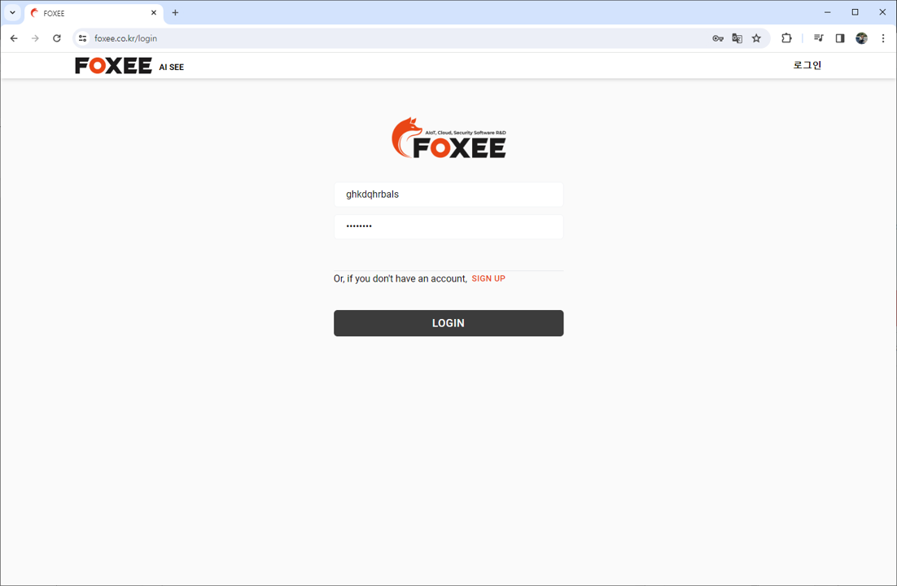
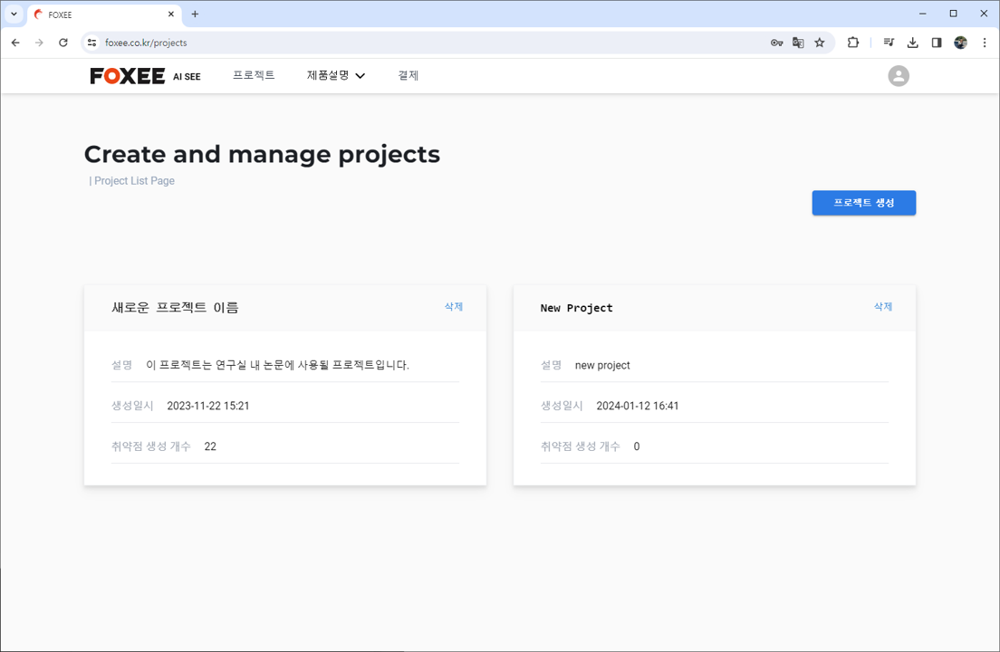
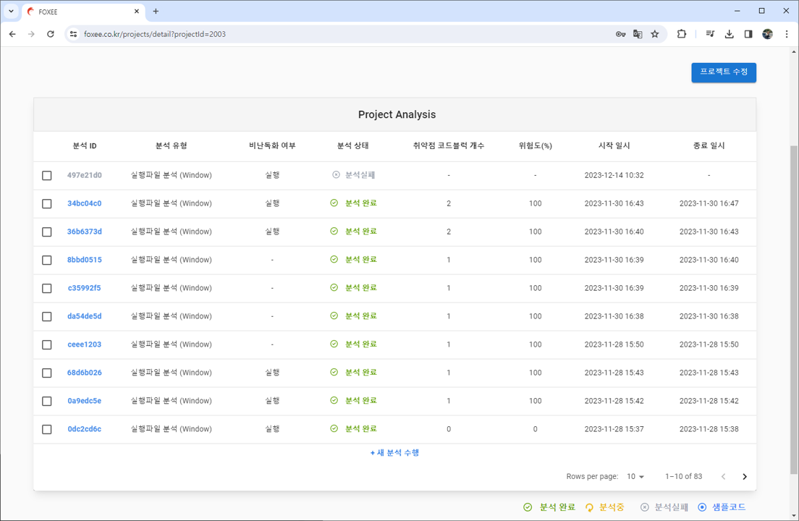
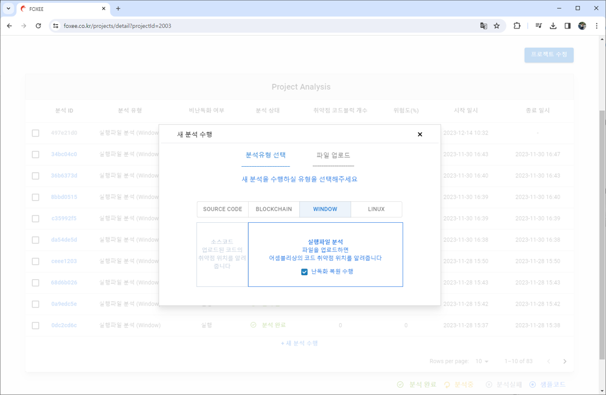
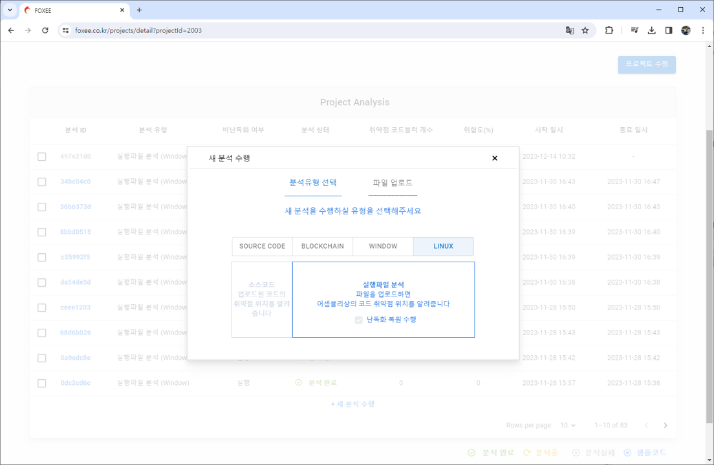
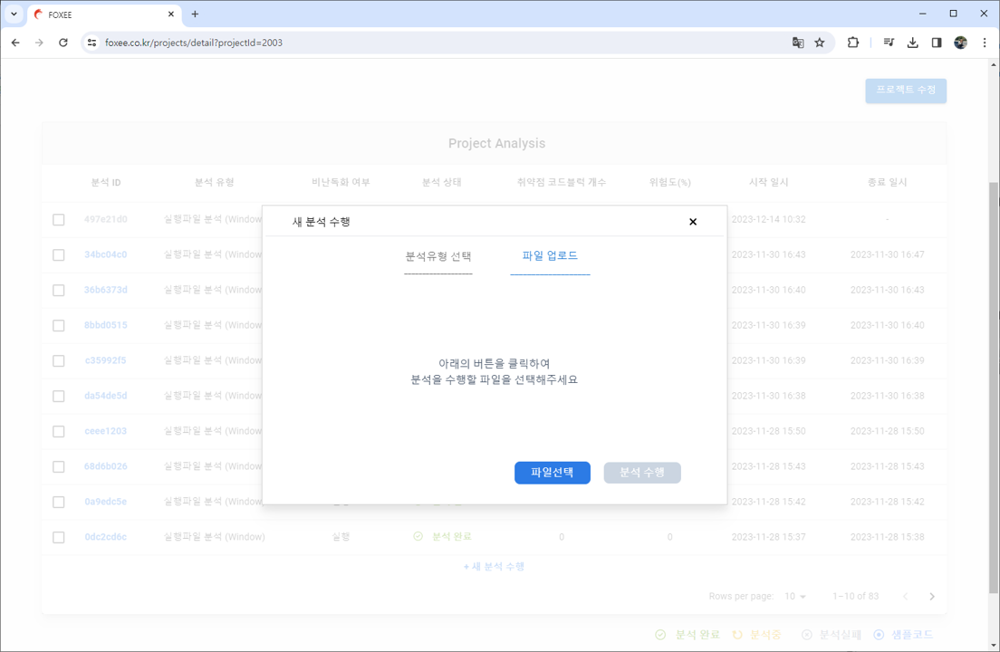
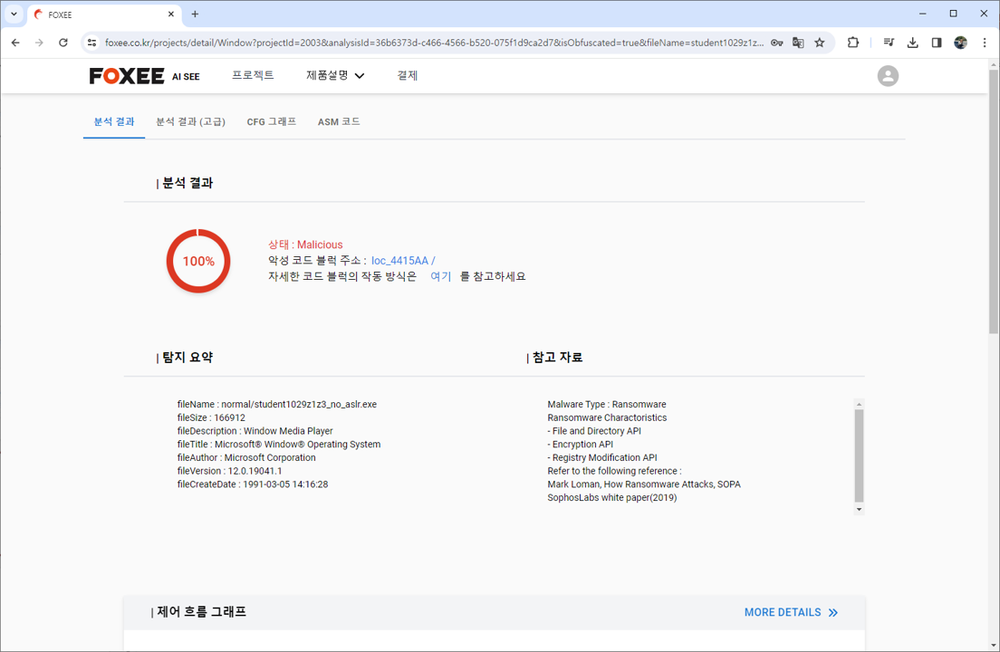
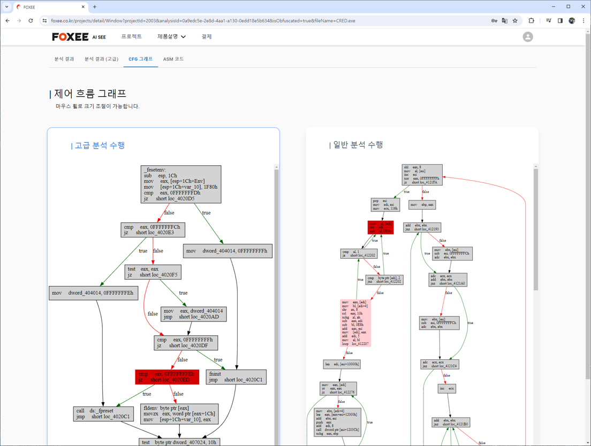

# **XAI를 활용한 취약점 분석 웹 어플리케이션**

### 프로젝트 개요

**XAI를 활용한 취약점 분석 웹 어플리케이션** 은 FOXEE 에서 진행했던 프로젝트로 Grad CAM XAI 을 통한 윈도우/리눅스 실행파일 악성코드 위치 검출서비스를 제공합니다 😊
> 본 프로젝트 개발은 AI 1명, 백엔드 1명, 프론트 1명 총 3명으로 진행되었으며 저는 백엔드 파트를 맡았습니다.

### 프로젝트에서 담당하여 진행한 업무

저는 아래와 같은 개발업무를 진행하였습니다.

* **레거시 코드 수정** : 기존 데이터 전처리, 모델 추론 레거시 코드를 수정하였습니다
* **RestAPI 구현** : 메인서비스의 RestAPI 를 Spring/Java 로 구현하였으며, 모델서버의 RestAPI 를 FastAPI/Python 으로 구현하였습니다
* **결제 정보처리** : 결제 사전/사후 처리과정을 메인 서비스에 적용하였습니다
* **RDB Schema 설계** : 도메인에 맞게 유저, 라이센스, 취약점 정보 저장을 위한 Postgresql RDB Schema 설계 및 엔티티와 dto 들을 구현하였습니다
* **테스트 코드 작성** : 개인시간에 155개의 단위/통합 테스트코드를 작성하면서 QA 를 최소화하였습니다
* **비동기 작업** : CompletableFuture, 세션을 통해 사용자의 이메일 인증을 구현하였습니다
* **JWT 인증 시스템 구현** : 메인서비스나 모델서비스에서도 인증을 적용하기 위해 여러 서버에서 공통적으로 사용할 수 있는 JWT 인증방식을 구현하였습니다
* **SSE 모델서버 진행도 확인** : 모델 추론 시 전체과정은 약 5분 정도 소요됩니다(데이터 전처리 + Control-Flow-Graph 생성 + 비난독화 + etc). 사용자가 실시간으로 진행정도를 볼 수 있도록 Server Sent Event 를 적용하였습니다
* **악성코드 통계작성** : 2015 Window 악성코드 데이터 셋을 기반으로 N-gram 대표 특성을 도출하였습니다. 이를 기반으로 AI 팀원분의 모델 성능을 향상시킬 수 있었습니다
* **배포 자동화** : Git Actions 와 Docker, Shell script 를 활용한 모델/메인 백엔드/프론트 서버의 자동배포를 구현하였습니다. 이 부분은 개인프로젝트에 먼저 적용해보고 실제 안정성과 개발효율을 체감하고 팀에 건의하여 진행되었습니다

이 밖의 여러 부분에서 업무를 진행하였습니다!

* **RestAPI 문서 작성** : Swagger가 생각보다 Exception을 문서화하기 까다로워서 따로 노션으로 작성하였습니다
* **화면 설계서 작성 및 초기 UI 디자인** : 어떤 화면이 필요하고 어떤 내용을 어떻게 보여줄 지 예상되는 화면이 있다면 개발 시 편할 것 같아서 Protopie 로 작성하였습니다
* **간단한 프론트 구현** : 프론트 팀원분께 도움이 되고자 로그인, 결제처리, 상품추가 등 간단하게 테스트 해볼 수 있는 화면들을 Spring-Thymeleaf. html, css 로 구현하였습니다
* **모든 메소드 주석달기** : 정말 존재하는 모든 메소드에 주석을 javadoc 스타일로 달아서 개발 친화적인 코드로 만들었습니다
* **리팩토링 * 1000** : 메소드들을 통합하고 비즈니스 로직을 바꿔보면서 코드 품질을 향상시키려 노력했습니다

### AI SEE 솔루션 화면

