{: .no_toc .text-delta }

1. TOC
{:toc}

1인 프로젝트로 진행된 자동화 및 성능개선에 초점을 둔 Spring-Java 기반 채팅 백엔드/프론트 서버 프로젝트입니다 😊

2022.11 부터 시작해서 2024.02 까지 약 1년 3개월이 걸렸네요! 중간중간 현업과 병행하다보니 더딘부분도 있었지만 결국 마무리하게 되었습니다. 제가 좋아하는 자동화와 성능개선을 마음껏 할 수 있어서 정말 재미있는 프로젝트였습니다.

* Github : [https://github.com/ghkdqhrbals/spring-chatting-server](https://github.com/ghkdqhrbals/spring-chatting-server)

-----

## 적용된 기술스택
현재 적용된 기술스택은 아래와 같습니다.

### Backend
* Spring-Boot / Java 17
* Spring-Security / Data-JPA / Cloud
* Postgresql, Redis
* Tomcat, Nginx
* JUnit5, Mockito, testContainer, nGrinder
* JWT

### Infrastructure & Cloud
* Docker, Kubernetes
* AWS-IAM / EKS / ECR / RDS / EC2 / ELB / Route-53 / Cloud-Watch / Auto Scaleing
* Git Actions, shell script, gradle script
* Grafana & Prometheus, io.micrometer
* Kafka, RabbitMQ

### Front
* Spring stomp
* Thymeleaf, html, css

-----

## 💡 아키텍처
### [Backend] 쿠버네티스 파드
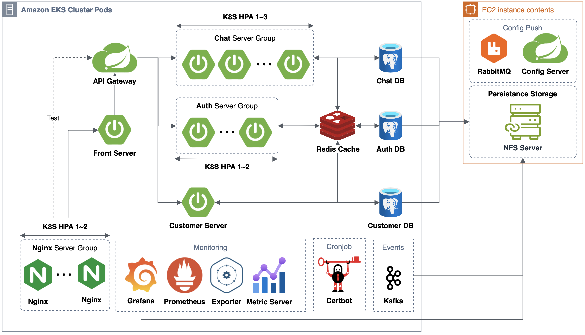
### [Backend] EC2 Instnace 평균 CPU 사용률에 따른 노드 스케일 인/아웃
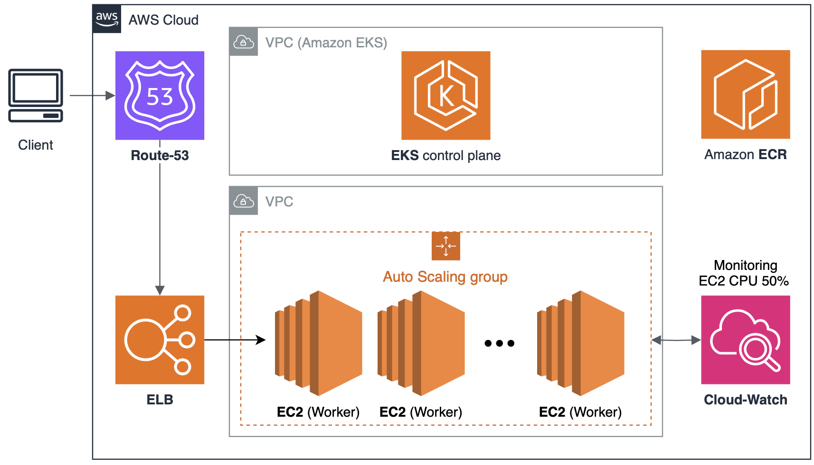
### [Backend] Git Actions multijob CI/CD 자동화

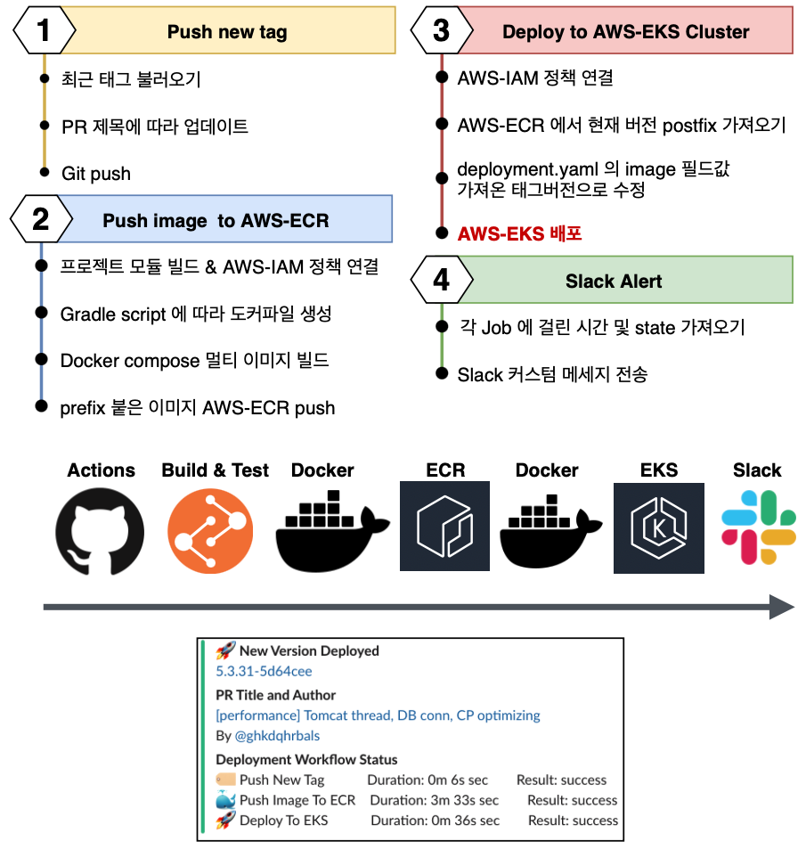

### [Frontend] Front UI

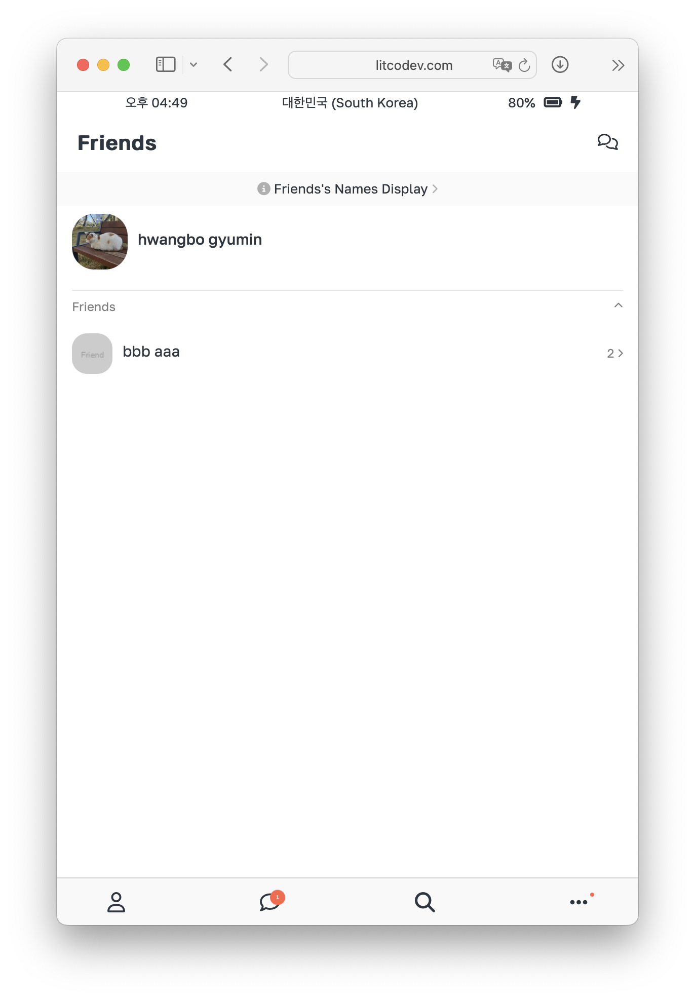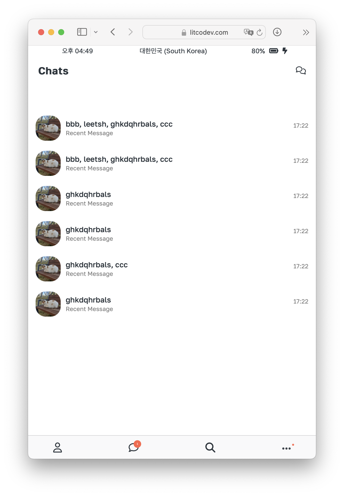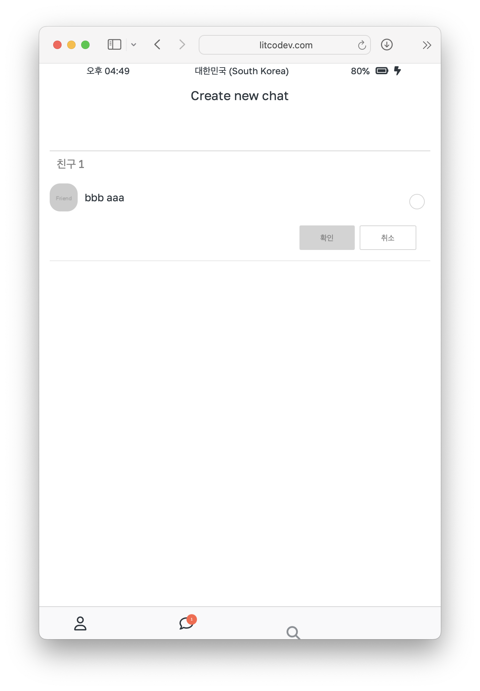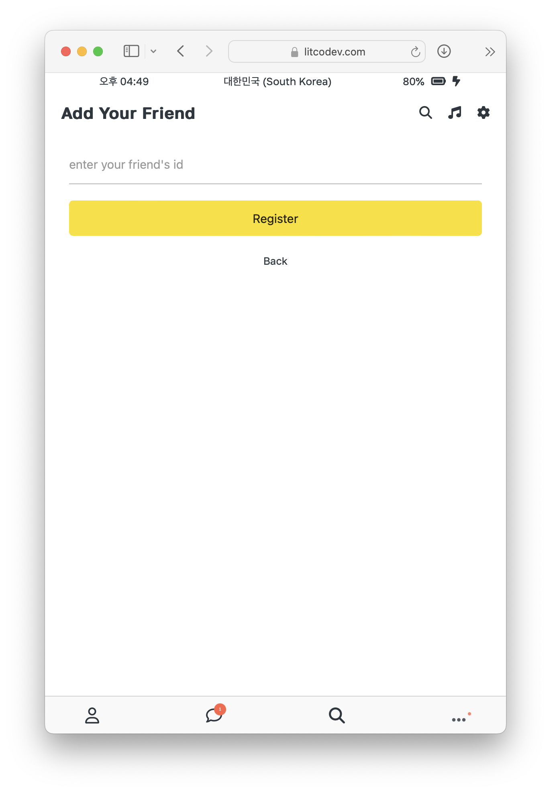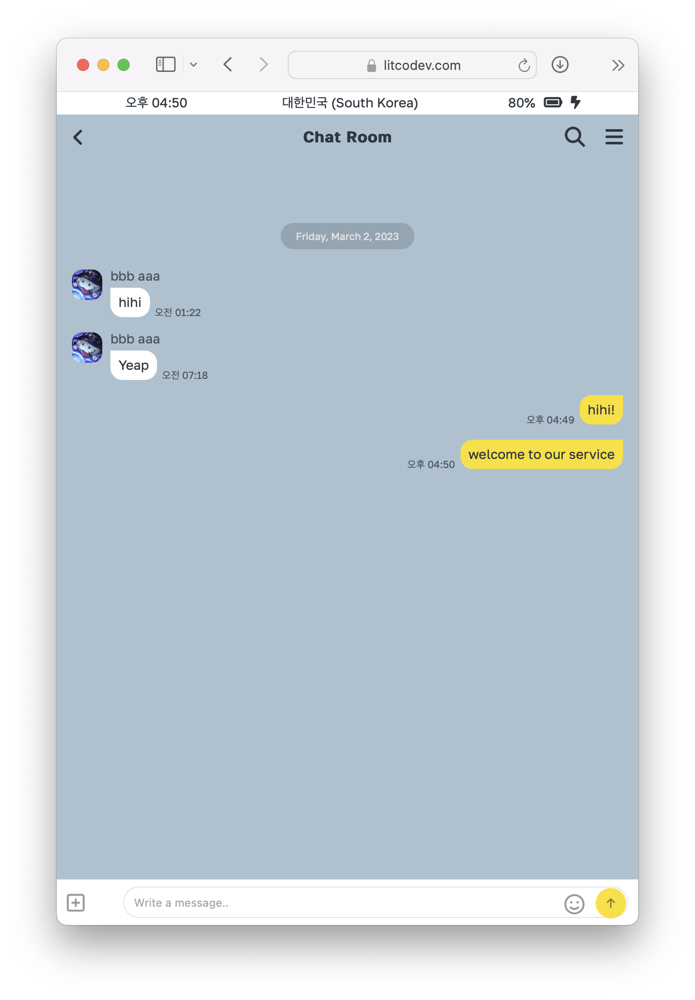

------

## 🔨 성능 이슈 해결 및 최적화 과정

성능 최적화 방법과 결과를 [link](https://github.com/ghkdqhrbals/spring-chatting-server/issues?q=is%3Aissue+label%3A%22feature%3A+performance%22+) 에 상세히 정리하였습니다! 이를 바탕으로 작성한 포스팅입니다. 

* 2023-01-16 [성능 최적화 과정 - 1](https://ghkdqhrbals.github.io/portfolios/docs/project/2023-01-16-chatting(13)/) : 도커 리소스 추가와 서버 수평 확장를 통한 성능 최적화 진행
* 2023-01-17 [성능 최적화 과정 - 2](https://ghkdqhrbals.github.io/portfolios/docs/project/2023-01-17-chatting(15)/) : JPA-Batch를 통한 성능 최적화 진행
* 2023-01-24 [성능 최적화 과정 - 3](https://ghkdqhrbals.github.io/portfolios/docs/project/2023-01-24-chatting(17)/) : JDBC-Batch 성능 그래프 확인
* 2023-01-27 [성능 최적화 과정 - 4](https://ghkdqhrbals.github.io/portfolios/docs/project/2023-01-27-chatting(18)/) : JDBC Batch 최적화 및 Postgresql 병렬 프로세서 확장
* 2023-03-05 [성능 최적화 과정 - 5](https://ghkdqhrbals.github.io/portfolios/docs/project/2023-03-05-chatting(21)/) : AWS-RDS 그래프 지표 관찰 및 db connection 증가를 통한 성능 최적화 진행
* 2023-03-11 [성능 최적화 과정 - 6](https://ghkdqhrbals.github.io/portfolios/docs/project/2023-03-11-chatting(23)/) : 부하 테스트를 위한 툴 제작 및 실제 테스트 결과
* 2023-03-16 [성능 최적화 과정 - 7](https://ghkdqhrbals.github.io/portfolios/docs/project/2023-03-16-chatting(25)/) : RDB 인덱싱 활성화를 통한 성능 최적화 진행
* 2023-05-01 [성능 최적화 과정 - 8](https://ghkdqhrbals.github.io/portfolios/docs/project/2023-05-01-chatting(35)/) : 이벤트 전송 스레드 증가를 통한 성능 최적화 진행
* 2023-12-21 [성능 최적화 과정 - 9](https://ghkdqhrbals.github.io/portfolios/docs/project/2023-12-21-chatting(40)/) : HPA(max 3), ReadinessProbe, CPU limit, EKS NodeGroup AutoScaling O(CPU usage 50%), Caching, 톰켓 최적화

    

 개선된 지표확인 

    
    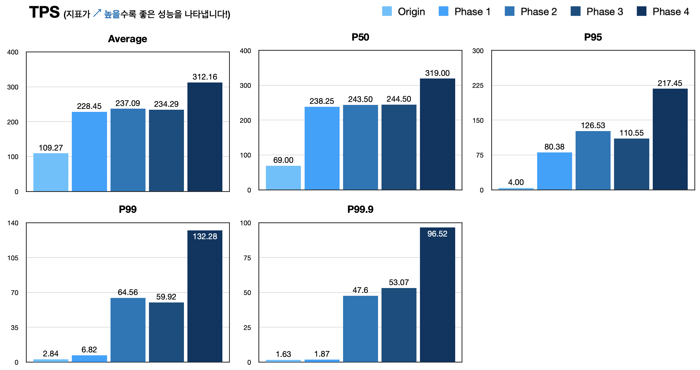
    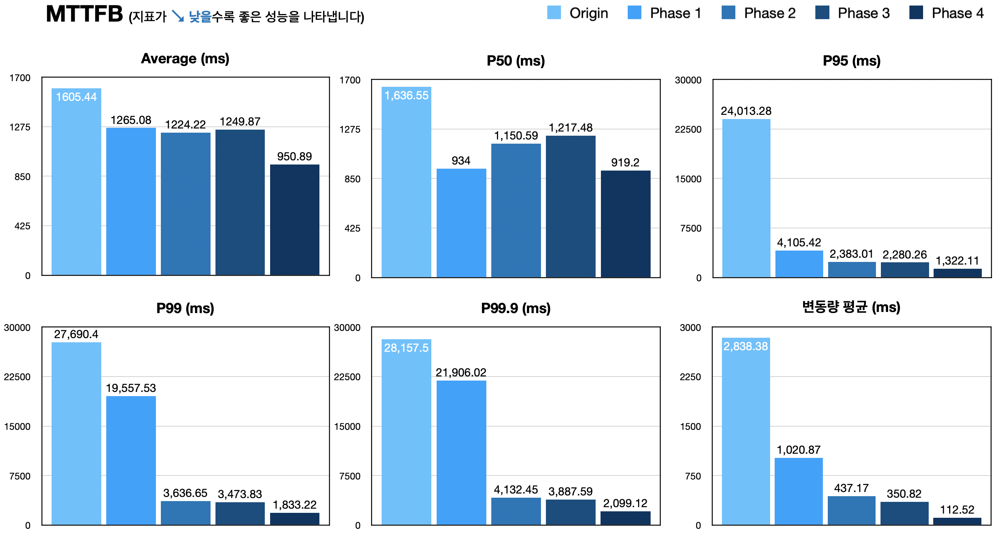
    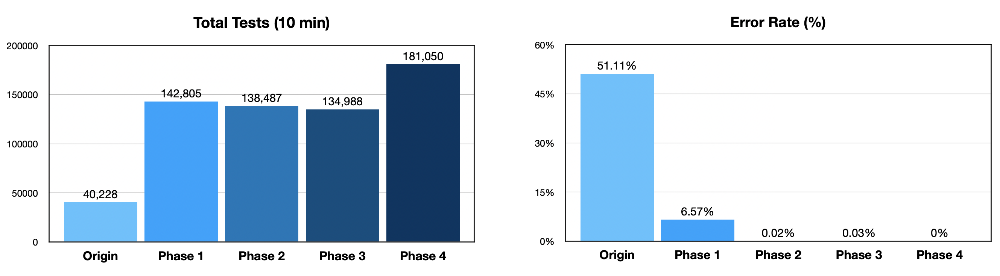
    
    | Metric             | Before       | After        | Change      |
    |--------------------|--------------|--------------|-------------|
    | Total Tests        | 40,228       | 181,050      | **349.29% 🟢**  |
    | Error Rate         | 51.11%(20,560)| 0.00%(0)     | **No Error 🟢** |
    | TPS 평균 (Average)  | 109.27       | 312.16       | **185.94% 🟢**  |
    | TPS p50            | 69.00        | 319.00       | **362.32% 🟢**  |
    | TPS p95            | 4.00         | 217.45       | **5362.50% 🟢** |
    | TPS p99            | 2.84         | 132.28       | **4556.34% 🟢** |
    | TPS p99.9          | 1.63         | 96.52        | **5852.76% 🟢** |
    | MTTFB 평균 (Average)| 1605.44 ms   | 950.89 ms    | **-40.68% 🟢**  |
    | MTTFB p50          | 1636.55 ms   | 919.20 ms    | **-43.90% 🟢**  |
    | MTTFB p95          | 24013.28 ms  | 1322.11 ms   | **-94.47% 🟢**  |
    | MTTFB p99          | 27690.40 ms  | 1833.22 ms   | **-93.40% 🟢**  |
    | MTTFB p99.9        | 28157.50 ms  | 2099.12 ms   | **-92.52% 🟢**  |
    | MTTFB 차이 평균 (Average Difference)| 2838.38 ms | 112.52 ms | **-96.04% 🟢**  |
    | MTTFB 평균적인 변동률 (Average Variability)| 75.00% | 10.67% | **-85.77% 🟢**  |
    
    

* 2023-12-29 [성능 최적화 과정 - 10](https://ghkdqhrbals.github.io/portfolios/docs/project/2023-12-29-chatting(41)/) : Nginx Ingress replicaSet=2~3

    

 개선된 지표확인 

    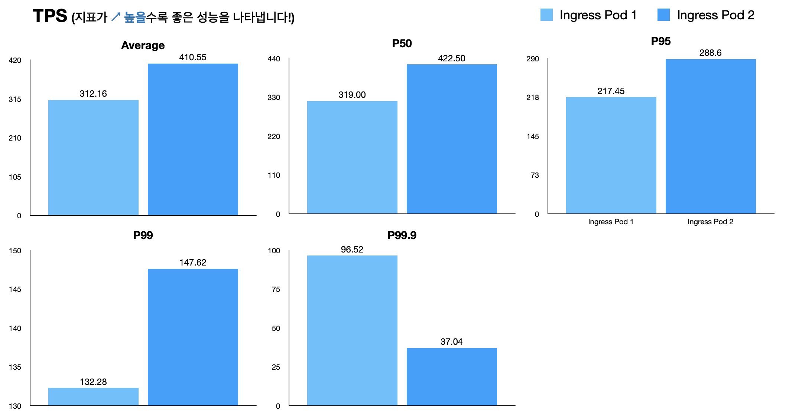
    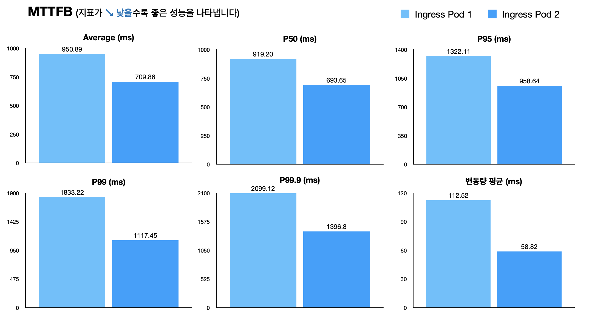
    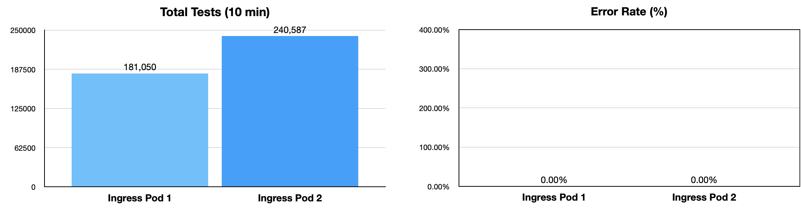

    | Metric                               | Ingress Pod 1 | Ingress Pod 2 | Change     |
    |--------------------|---------------|------------|-------------------|-------------|
    | Total Tests                          | 181,050       | 240,587       | 32.93% 🟢  |
    | Error Rate                          | 0.00%(0)      | 0.00%(3)      | N/A        |
    | TPS 평균 (Average)                     | 312.16        | 410.55        | 31.51% 🟢  |
    | TPS p50                              | 319.00        | 422.50        | 32.38% 🟢  |
    | TPS p95                              | 217.45        | 288.60        | 32.69% 🟢  |
    | TPS p99                              | 132.28        | 147.62        | 11.62% 🟢  |
    | TPS p99.9                            | 96.52         | 37.04         | -61.68% 🔴 |
    | MTTFB 평균 (Average)                   | 950.89 ms     | 709.86 ms     | -25.29% 🟢 |
    | MTTFB p50                            | 919.20 ms     | 693.65 ms     | -24.54% 🟢 |
    | MTTFB p95                            | 1322.11 ms    | 958.64 ms     | -27.49% 🟢 |
    | MTTFB p99                            | 1833.22 ms    | 1117.45 ms    | -39.05% 🟢 |
    | MTTFB p99.9                          | 2099.12 ms    | 1396.80 ms    | -33.54% 🟢 |
    | MTTFB 차이 평균 (Average Difference)     | 112.52 ms     | 58.82 ms      | -47.66% 🟢 |
    | MTTFB 평균적인 변동률 (Average Variability) | 10.67%        | 7.67%         | -28.09% 🟢 |
    
    

* 2024-01-03 [성능 최적화 과정 - 11](https://ghkdqhrbals.github.io/portfolios/docs/project/2024-01-03-chatting(42)/) : RDB b-tree Long type PK indexing

    

 개선된 지표확인 

    
    | Metric          | Before     | After      | Change            |
    |-----------------|------------|------------|-------------------|
    | Total Tests     | 220,313    | 236,957    | 7.54% 🟢          |
    | Error Rate      | 0.00%(7)   | 0.00%(0)   | -                 |
    | TPS 평균          | 377.24     | 404.36     | 7.18% 🟢          |
    | TPS p50         | 390.25     | 420.50     | 7.76% 🟢          |
    | TPS p95         | 270.60     | 277.90     | 2.69% 🟢          |
    | TPS p99         | 92.58      | 64.34      | -30.53% 🔴        |
    | TPS p99.9       | 34.05      | 43.17      | 26.74% 🟢         |
    | MTTFB 평균        | 496.27 ms  | 456.42 ms  | -8.03% 🟢         |
    | MTTFB p50       | 480.31 ms  | 431.84 ms  | -10.07% 🟢        |
    | MTTFB p95       | 882.81 ms  | 799.67 ms  | -9.41% 🟢         |
    | MTTFB p99       | 1163.81 ms | 1130.67 ms | -2.84% 🟢         |
    | MTTFB p99.9     | 1225.86 ms | 1275.62 ms | 4.06% 🔴          |
    | MTTFB 차이 평균     | 106.51 ms  | 74.02 ms   | -30.46% 🟢        |
    | MTTFB 평균적인 변동률  | 20.77%     | 15.27%     | -26.60% 🟢        |
    
    

  
* 2024-02-04 [성능 최적화 과정 - 12](https://ghkdqhrbals.github.io/portfolios/docs/project/2024-02-04-chatting(47)/) : RDB 캐싱 (Look-Aside + Write-Around)

    

 개선된 지표확인 

    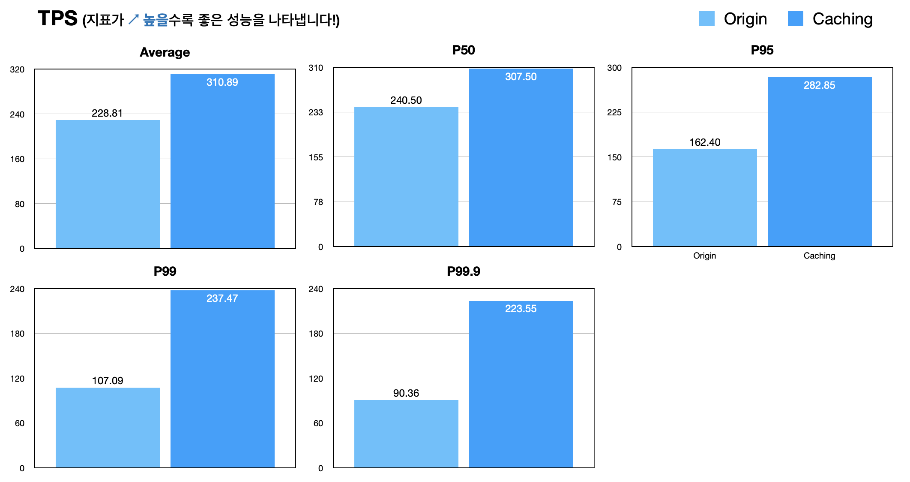
    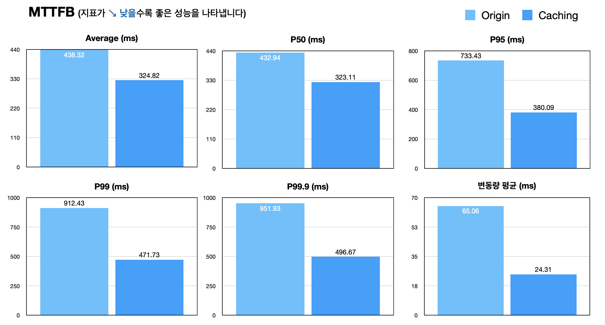
    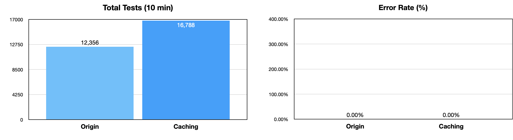    

    | Metric                               | Before       | After        | Change     |
    |--------------------|--------------|--------------|------------|
    | Total Tests                          | 12,356       | 16,788       | 36.00% 🟢  |
    | Error Rate                           | 0.00%(0)     | 0.00%(0)     | 0 ⚪        |
    | TPS 평균 (Average)                     | 228.81       | 310.89       | 35.87% 🟢  |
    |  TPS p50                             | 240.50       | 307.50       | 27.84% 🟢  |
    | TPS p95                              | 162.40       | 282.85       | 74.20% 🟢  |
    | TPS p99                              | 107.09       | 237.47       | 121.77% 🟢 |
    | TPS p99.9                            | 90.36        | 223.55       | 147.24% 🟢 |
    | MTTFB 평균 (Average)                   | 438.32 ms   | 324.82 ms   | -25.93% 🟢 |
    | MTTFB p50                            | 432.94 ms   | 323.11 ms   | -25.27% 🟢 |
    | MTTFB p95                            | 733.43 ms   | 380.09 ms   | -48.14% 🟢 |
    | MTTFB p99                            | 912.43 ms   | 471.73 ms   | -48.31% 🟢 |
    | MTTFB p99.9                          | 951.93 ms   | 496.67 ms   | -47.85% 🟢 |
    | MTTFB 차이 평균 (Average Difference)     | 65.06 ms | 24.31 ms | -62.68% 🟢 |
    | MTTFB 평균적인 변동률 (Average Variability) | 13.73% | 7.67% | -44.11% 🟢 |
    
    

------

## 📕 프로젝트를 수행하기 위해 따로 공부 및 정리한 포스팅 
* [메세지큐 - 1](https://ghkdqhrbals.github.io/portfolios/docs/메세지큐/2022-12-01-message-queue/) : 메세지 큐의 장점과 단점 정리
* [메세지큐 - 2](https://ghkdqhrbals.github.io/portfolios/docs/메세지큐/2022-12-02-kafka/) : Kafka 용어정리 및 구조 파악 
* [마이크로서비스 - 1(EN)](https://ghkdqhrbals.github.io/portfolios/docs/msa/2022-09-05-micro-service-architecture2/) : 기본적인 MSA 의 장단점 및 이해 정리
* [마이크로서비스 - 2](https://ghkdqhrbals.github.io/portfolios/docs/msa/2022-09-04-micro-service-architecture1/) : SAGA 패턴에 대한 이해 정리 
* [마이크로서비스 - 3](https://ghkdqhrbals.github.io/portfolios/docs/msa/2023-03-22-msa1/) : DDD 에 대한 이해와 이벤트 롤백처리에 대한 이해 정리
* [마이크로서비스 - 4(EN)](https://ghkdqhrbals.github.io/portfolios/docs/msa/2022-05-30-msa-docker-kubernetes/) : Docker/Kubernetes 이해 정리
* [웹서버 - 1](https://ghkdqhrbals.github.io/portfolios/docs/Java/6/) : Netty 아키텍처 및 동작원리 정리 
* [웹서버 - 2](https://ghkdqhrbals.github.io/portfolios/docs/Java/5/) : JVM NIO 모델에서 Reactor 모델까지의 변천사 정리
* [스프링 - 1](https://ghkdqhrbals.github.io/portfolios/docs/Java/2/) : Spring-Webflux 정리
* [스프링 - 2](https://ghkdqhrbals.github.io/portfolios/docs/Java/3/) : Reactor 모델에서의 Spring-security 인가 설정 정리
* [엘라스틱서치 - 1](https://ghkdqhrbals.github.io/portfolios/docs/elasticSearch/2022-12-31-elastic-search/) : RDB 와 ElasticSearch 비교 정리
* [엘라스틱서치 - 2](https://ghkdqhrbals.github.io/portfolios/docs/elasticSearch/2023-01-01-elastic-search(2)/) : ElasticSearch 노드 운용 방법 정리
* [엘라스틱서치 - 3](https://ghkdqhrbals.github.io/portfolios/docs/elasticSearch/2023-01-02-elastic-search(3)/) : LogStash 와 Kibana 를 붙여 하나의 스택을 통한 시각화 과정 정리
* [관계형데이터베이스 - 1](https://ghkdqhrbals.github.io/portfolios/docs/데이터베이스/db1/) : 쿼리 최적화 방법 정리
* [관계형데이터베이스 - 2](https://ghkdqhrbals.github.io/portfolios/docs/데이터베이스/2022-11-20-DB-3/) : 데이터 정합성 이론 정리
* [Golang - 1](https://ghkdqhrbals.github.io/portfolios/docs/Go언어/2022-09-18-thread-goroutine/) : 부하 테스트 툴 제작 시 필요한 경량 스레드 구조 정리
* [Java - 1](https://ghkdqhrbals.github.io/portfolios/docs/Java/java3/) : 자바의 CompletableFure 을 통한 콜백/멀티스레딩 정리
* [Java - 2](https://ghkdqhrbals.github.io/portfolios/docs/Java/java1/) : 자바의 동기/비동기 Blocking/Non-blocking 정리
* [Git 컨벤션 - 1](https://accurate-allspice-e0a.notion.site/git-convention-9e8f78c9d33346bca965c30fb6537d5a) : Git 컨벤션 정리
* [JWT - 1](https://accurate-allspice-e0a.notion.site/jwt-2eb41c679cfe4fa4b5210594482b8025?pvs=4) : 토큰 저장 시 주의사항 및 구현 방식 정리

그 밖에 Reactor, R2DBC, Spring-WebFlux Transactional 처리, K8S, AWS, etc. 

## 📗 프로젝트 진행 포스팅