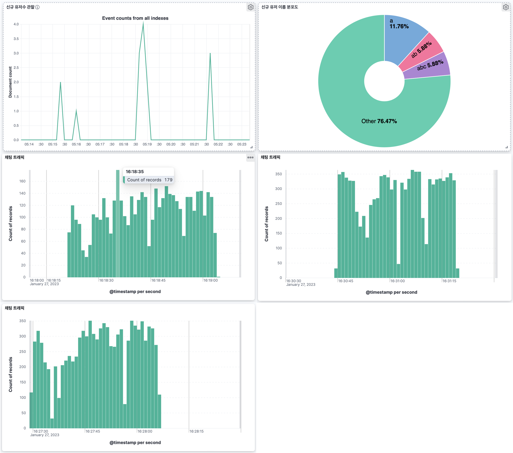
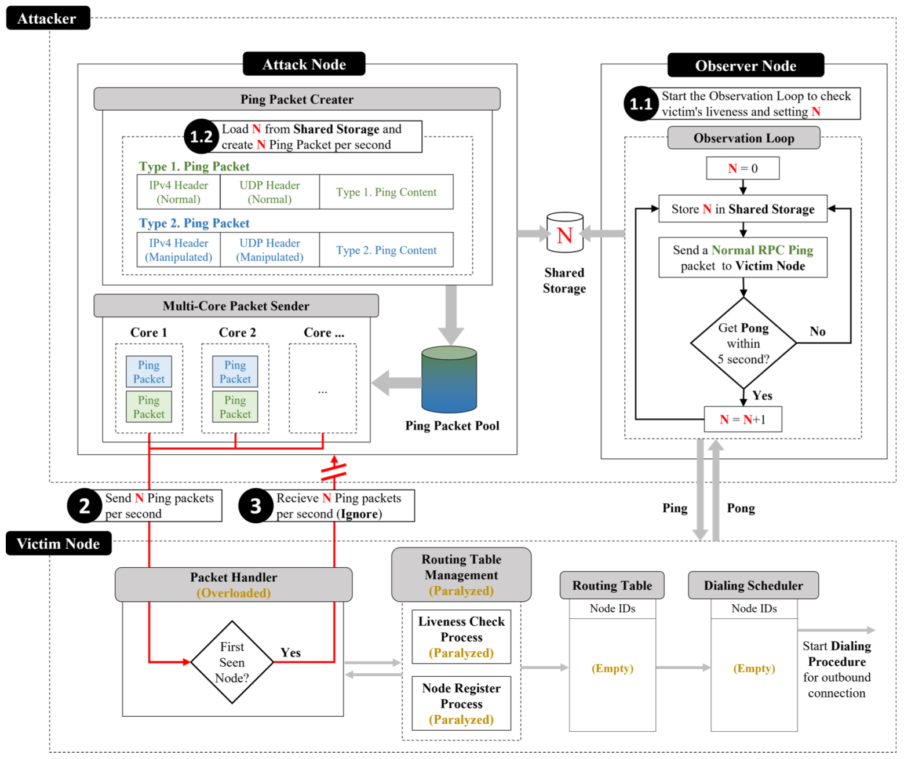
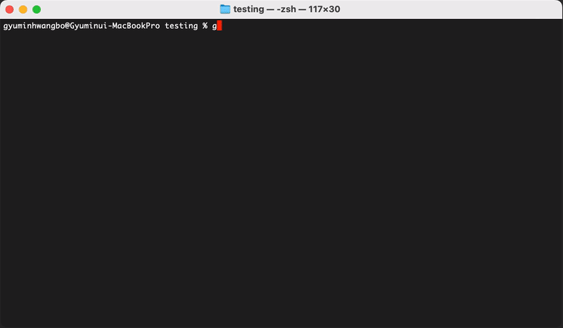
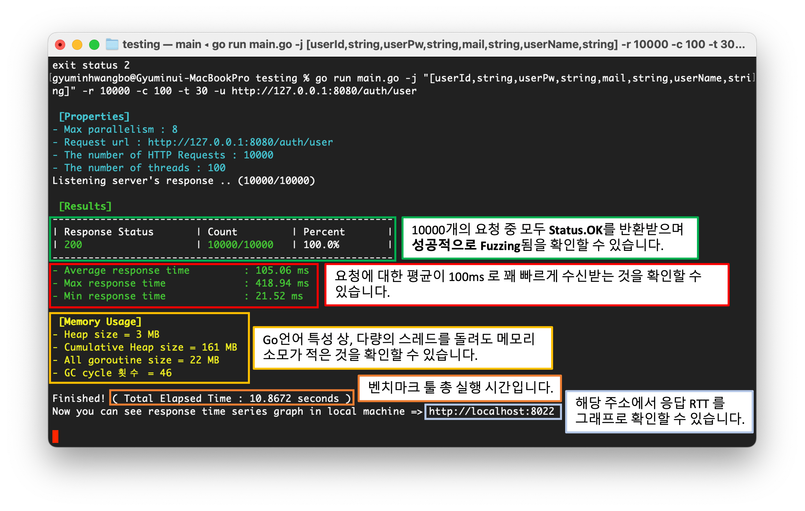
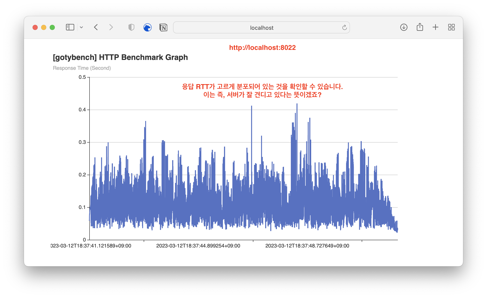
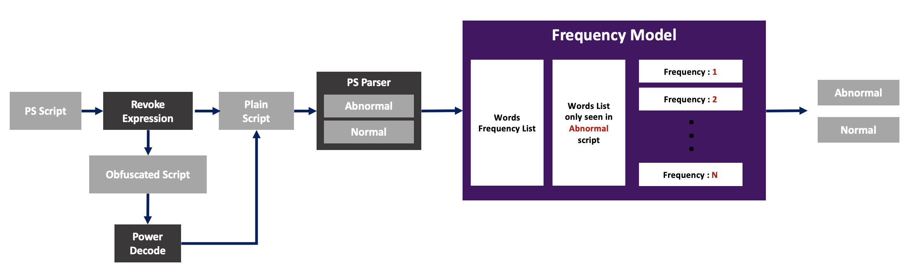

#### INDEX
1. [Introduction](#introduction)
2. [Education](#education)
3. [Skill](#skill)
4. [Main Project](#main-projects)
5. [Toy Project](#toy-projects)
6. [Activity](#activity)

# Introduction

안녕하세요. 신입 개발자 황보규민입니다. 저는 **장애발생에 미리 대응**하길 좋아하며, **확장성 있는 시스템을 구축**하는 것을 좋아하는 사람입니다.

따라서 저는 다양한 기술들을 아래의 프로젝트들에 다음과 같이 적용하였습니다. 

* **실시간 채팅 서버 프로젝트**
    > #### 확장성 있는 시스템 구축
    > 1. MQ Kafka 를 통해 Consumer 별 오프셋을 제공함으로써 서버를 수평확장하기 쉬운 아키텍처를 구성하였습니다.
    > 2. Docker 를 통해 약 **20개**의 컨테이너를 자동으로 관리하며, 이미지 재사용성을 높이고, 환경관리를 통합하였습니다.
    > 3. API gateway 를 통해 백엔드의 통합 entry point를 제공하고, 로드밸런싱을 적용함으로써 외부에서 쉽게 접근하고 확장이 용이하도록 설계하였습니다.
    >
    > #### 장애대응
    > 1. Kafka 를 multi-broker로 설정하고 메세지들의 replica를 설정함으로써, 메세지 유실장애에 대응하였습니다.
    > 2. Debezium/JDBC-sink-connector을 통해 백업 DB를 설정함으로써, DB 유실장애에 대응하였습니다.
    > 3. JPA-Batch, 쿼리빈도 최적화, 로드밸런싱을 통해, 대용량 트래픽 장애에 대응하였습니다.
    > 4. async/Non-blocking MQ 메세지 송신을 통해, 성능 장애에 대응하였습니다.
    > 5. ELK 스택, Kafdrop 을 통해 Kafka 내부 및 전체 서비스를 모니터링함으로써, 병목현상 원인을 파악하였습니다.
    >
    > 

시각화된 자료 펼치기

    >
    >  
    > 

* **뱅킹 백엔드 서버**
    > #### 확장성 있는 시스템 구축
    > * Docker/Kubernetes 를 통해 각각의 `Pod`들의 재시작/실행을 자동화하였으며, replica 설정을 통해 쉽게 확장용이하도록 설계하였습니다.
    > 
    > #### 장애대응
    > 1. AWS의 secret 저장소를 활용하여, 키 보안장애에 대응하였습니다.
    > 2. JWT 토큰과 PASETO 토큰을 인증에 사용함으로써, 서버의 세션 과부화에 대응하였습니다.
    > 3. Bcrpyt 암호화를 사용자 패스워드에 적용함으로서, DB 탈취 시 사용자의 원본 패스워드 탈취에 대응하였습니다.
    > 4. TLS 인증서를 Ingress에 적용함으로써, 패킷 탈취에 대응하였습니다.

# Education

* **부산대학교(석사)**
  * 기간 : 2020년 09월 ~ 2022년 08월 GPA: 4.25
  * 전공 : 컴퓨터공학
* **부산대학교(학사)**
  * 기간 : 2014년 03월 ~ 2020년 08월
  * 전공 : 컴퓨터공학
* **부일외국어고등학교**
  * 2010-03 ~ 2013-02

# Skill

* Backend
  * Java, Golang
  * Spring Boot, Spring Data JPA, JPA, Gin
  * Junit5, Mockito, Gmock
  * Gradle
  * IntelliJ, Visual Studio Code
* DevOps
  * PostgreSQL, ELK stack
  * AWS route-53, EC2, RDS, ECR, EKS
  * Kafka, Docker, Nginx
  * Linux

# Main Projects

[개발과정](https://ghkdqhrbals.github.io/portfolios/docs/project/){: .btn .btn-primary .fs-2 .mb-4 .mb-md-0 .ml-5 } [Github](https://github.com/ghkdqhrbals/spring-chatting-server){: .btn .btn-black .fs-2 .mb-4 .mb-md-0 } [설명 및 시연영상](https://www.youtube.com/watch?v=3VqwZ17XyEQ&t=625s){: .btn .btn-red .fs-2 .mb-4 .mb-md-0 }
* 📌 **실시간 채팅 서버 프로젝트** 
  * **개요** : Kafka와 ELK stack을 통해 실시간 트래픽 관찰 및 안전성과 확장성을 고려한 Spring-Java 기반 채팅 백엔드/프론트 서버 프로젝트입니다.
    * #### 성능개선 
      채팅저장, 유저저장 api 요청에 소요되는 시간을 각각 **270%, 470% 개선**하였습니다. 결과로 한번의 채팅저장, 유저저장 api 요청에 소요되는 시간은 각각 **3ms**, **2.3ms**로 개선되었습니다. 
    * #### 확장성 고려
      Docker, Kafka 를 통해 **서버를 확장하기 쉬운 아키텍처**를 구성하였습니다. 또한 백엔드의 통합 entry point를 api gateway로 설정하여 외부에서 쉽게 접근하도록 설계하였습니다.
    * #### 모니터링
      ELK stack 을 통해 유저저장/채팅 **트래픽을 실시간으로 관찰**할 수 있도록 설정하였습니다. 또한 Kafka 내부 메세지를 쉽게 모니터링 할 수 있도록 설정하였습니다.
    * #### 안정성 고려
      DB가 유실되는 상황을 고려하여 Debezium/JDBC-sink-connector와 Kafka를 연동하여 단반향 동기화된 **Backup DB를 구성**하였습니다.
  * **기간** : 2022년 10월 ~ current (6개월)
  * **인원** : 1인
  * 

사용기술 펼치기

    | 사용기술                         | 내용                                                                                                          |
------------------------------|:-----------------------------|:------------------------------------------------------------------------------------------------------------|
    | ELK stack                    | Elastic Search + Logstash + Kibana 를 통한 통계수집/시각화 [Image](https://ghkdqhrbals.github.io/assets/img/es/5.png) |
    | Kafka                        | 3대의 Broker과 replica들을 통한 안전성 및 확장성 제공                                                                       |
    | Debezium/JDBC-Sink-connector | Kafka를 통한 백업 DB uni-directional sync [Details](https://ghkdqhrbals.github.io/posts/chatting(9)/)            |
    | Docker                       | 서버/DB/Kafka/Connector/ELK/Monitoring/etc. 실행 자동화                                                            |
    | Nginx                        | API gateway로써 채팅서버 및 인증서버를 묶어서 통합 RestApi entry point 제공                                                    |
    | Stomp                        | 채팅 실시간성 제공                                                                                                  |
    | JPA + JDBC                   | INSERT 문 JDBC 배치 프로세싱, 비동기 DB 관리                                                                                              |

    

    

  * 

아키텍처 펼치기

    
    
    

    

    

[Github](https://github.com/ghkdqhrbals/golang-backend-master){: .btn .btn-black .fs-2 .mb-4 .mb-md-0 .ml-5} 
* 📌 **뱅킹 백엔드 서버** 
  * **개요** : Gin-Golang 기반 뱅킹 RestAPI 백엔드 서버입니다
    * #### 배포 자동화
      Git-workflow로 AWS에 자동적으로 배포가능하도록 설계하였습니다.
    * #### 확장성 고려
      Docker/Kubernetes를 통해 서버가 자동적으로 AWS 내 수평확장할 수 있도록 설계하였습니다.
    * #### 서버 리소스 최적화
      JWT 토큰과 PASETO 토큰을 통해 서버의 세션유지 및 인증에 소모되는 리소스를 감소시켰습니다.
  * **기간** : 2022.06 ~ 2022.09 (4개월)
  * **인원** : 1인
  * 

사용기술 펼치기

    | 사용기술     | 내용                                                                                                                                              |
    |:------------------------------------------------------------------------------------------------------------------------------------------------|:----------------------------------------------------------------------------------------------------------------------|
    | AWS      | Git-workflow와 ECR/EKS/Route-53/IAM/secret-manager/RDS를 연동하여 CI/CD 파이프라인 구축 [Image](https://ghkdqhrbals.github.io/assets/img/golang/deploy.jpeg) |
    | JWT | 인증토큰으로 세션유지 리소스 최적화                                                                                                                             |
    | Bcrypt | HASH(password + salt) 로 안전한 DB 저장 [Image](https://ghkdqhrbals.github.io/assets/img/golang/safe-password-storing.jpeg)                           
    | Sqlc | sql문 인터페이스화                                                                                                                                     |
    | Docker/K8S | 서버+DB CI                                                                                                                                        |
    | Gin | RestApi 구현 [Details](https://github.com/ghkdqhrbals/golang-backend-master/wiki/ghkdqhrbals:gin)                                                 |
    | Viper | 외부 configuration 의존성 주입 [Details](https://github.com/ghkdqhrbals/golang-backend-master/wiki/ghkdqhrbals:viper)                                  |
    | Gmock | mock test [Details](https://github.com/ghkdqhrbals/golang-backend-master/wiki/ghkdqhrbals:mockdb)                                               |

    

    

    

[논문확인](https://scienceon.kisti.re.kr/srch/selectPORSrchArticleOrgnl.do?cn=DIKO0016457502){: .btn .btn-blue .fs-2 .mb-4 .mb-md-0 .ml-5} [소개영상](https://www.youtube.com/watch?v=HbAPQwbNtfw){: .btn .btn-red .fs-2 .mb-4 .mb-md-0 }
* 📌 **다중 Geth 취약점을 이용한 블록체인 이클립스 공격 설계** 
  * **개요** : Golang으로 제작된 이더리움 클라이언트(~1.9.25v)를 마비시키는 공격설계 논문입니다
    * #### 모니터링
      공격받는 노드의 현재 리소스 소모 상태를 하트비트를 통해 확인할 수 있도록 설계하였습니다. 또한 이를 이용하여 공격 패킷의 개수를 최적화 하였습니다.
    * #### 성능개선
      공격 패킷을 미리 생성함으로써 초당 전송할 수 있는 패킷개수를 **210% 증가**시킬 수 있었습니다.
    * #### IP spoofing
      UDP 패킷 내 소스 주소 및 포트를 랜덤하게 설정하여 희생자가 공격을 알아채지 못하도록 설정하였습니다.
  * **기간** : 2020.09 ~ 2022.08 (2년)
  * **인원** : 3인(1저자)
  * 

사용기술 펼치기

    | 사용기술                | 내용                                                                                                                                                      |
    |:--------------------|:--------------------------------------------------------------------------------------------------------------------------------------------------------|
    | DDoS                | UDP-based 분산 DoS 공격을 통한 노드의 연산 자원을 강제로 소모되도록 유도                                                                                                         |
    | Ethereum-analysis   | 이더리움 Geth 클라이언트의 라우팅 테이블 + 패킷 분석을 통한 내부구조 확인                                                                                                            |
    | IP 변환               | UDP-based DoS공격 + IP 변환을 통해 희생자 노드의 공격방어율 하락 유도                                                                                                         |
    | HeartBeat           | 희생자 노드의 HeartBeat 관측을 통해 공격 패킷개수 최적화                                                                                                                    |
    | Kademlia DHT        | 해당 테이블은 P2P상에서 연결하고자 하는 노드들을 저장하는 라우팅 테이블. 본 공격은 이를 드롭                                                                                                  |
    | Eclipse Attack      | 노드 고립 유도하여 블록 동기화 과정 진입 억제 [추가논문확인](https://ghkdqhrbals.github.io/assets/img/EthereumEclipseAttackAnalysis.pdf){: .btn .btn-blue .fs-2 .mb-4 .mb-md-0 } | 

    

    

  * 

아키텍처 펼치기

  
    
    

    

    

    
# Toy Projects

[개발과정](https://ghkdqhrbals.github.io/portfolios/docs/project/2023-01-15-chatting(11)/){: .btn .btn-primary .fs-2 .mb-4 .mb-md-0 .mr-2 .ml-5} [Github](https://github.com/ghkdqhrbals/multiple-restapi-request-test){: .btn .btn-black .fs-2 .mb-4 .mb-md-0 }
* 📌 **HTTP Benchmark Tool 개발**
  
  * **개요** : Golang, net/http 기반 다량의 HTTP를 전송하여 서버를 테스트할 수 있는 시뮬레이터입니다.
    * #### 자동화
      Docker-compose 와 Viper 를 통해 환경설정 및 실행을 자동화 하여 빠르게 테스트할 수 있도록 설계하였습니다.
    * #### 동시성 고려
      멀티 스레드 및 mutex lock 맵 및 채널을 사용하여 동시처리가능하도록 설계하였습니다.
    * #### 편의성 고려
      flag, uilive, graphing, fatih, dynamic-struct 를 사용하여 사용자 편의성을 증가시켰습니다.
  * **기간** : 2023.01 ~ 2023.03
  * **인원** : 1인
  
  * 

사용기술 펼치기

    | 사용기술              | 내용                                                                                                          |
-------------------|:--------|:------------------------------------------------------------------------------------------------------------|
    | Docker            | 환경설정 및 빌드&테스트 자동화 |
    | Viper             | 외부 configuration 의존성 주입                                                                             |
    | Dynamic structure | 오브젝트 필드 Dynamic 생성                                                                             |
    | Multi-threading      | 경량 고루틴 스레드 생성 및 스레드간 채널생성을 통해 동시성 증가                                                                 |
    | net/http      | 벤치마크 툴 클라이언트의 http 통신 설정                                                                 |

    

    

  * 

테스트 결과 펼치기

    
    
  
    

    

    

[Github](https://github.com/ghkdqhrbals/blockchain-with-python){: .btn .btn-black .fs-2 .mb-4 .mb-md-0 .ml-5}
* 📌 **블록체인 기반 친환경 에너지 거래 플랫폼 프로토타입** 
  * **개요** : python으로 제작된 블록체인 기반 친환경 에너지 거래 플랫폼의 프로토타입입니다. 합의 알고리즘에 집중하였습니다.
    * #### 새로운 합의 알고리즘 설계
      REC의 쌍방계약 형태에 맞춰 블록체인 트랜잭션을 이중서명 구조로 새롭게 제안합니다.
  * **기간** : 2021.03 ~ 2021.06
  * **인원** : 2인(팀원)
  * 

사용기술 펼치기

    | 사용기술 | 내용 |
    |:----|:-----|
    | 블록 생성자 결정 | 동기화된 네트워크에서 랜덤한 생성자를 결정할 수 있는 알고리즘 제작 = `𝑀𝑖𝑛𝑒𝑟=𝑀𝑎𝑥_𝐴𝑑𝑑𝑟 (ℎ𝑎𝑠ℎ(𝑃𝑟𝑒𝑣𝐵𝑙𝑜𝑐𝑘𝐻𝑎𝑠ℎ,𝐴𝑑𝑑𝑟)` `𝑀𝑎𝑥_𝐴𝑑𝑑𝑟`값이 가장 큰 노드가 블록 생성자로 결정됩니다 |
    | 블록 완결 | 합의에 의한 Block confirmation `∑(0<𝑖<𝑑)𝑅𝐸100_𝑖^𝑎𝑔𝑟𝑒𝑒 ≥2/3 𝑅𝐸100_𝑡𝑜𝑡𝑎𝑙` (PBFT와 동일) |

    

    

[Github](https://github.com/ghkdqhrbals/Malware_LSTM){: .btn .btn-black .fs-2 .mb-4 .mb-md-0 .ml-5}
* 📌 **빈도수 모델을 통한 악성 파워쉘 스크립트 탐지**
  * **개요** : python으로 제작된 Fileless Malware 중 파워쉘 스크립트 탐지 툴입니다.
    * #### 탐지 유연성 개선
      LSTM 와 TF/IDF 의 앙상블을 통해 기존 스태틱 탐지에 유연성을 더하였습니다.
    * #### 비난독화 고려
      난독화된 악성코드를 분석하는 것은 오히려 성능에 악영향을 미칩니다. 따라서 저희는 Revoke Expression으로 난독화 정도를 파악한 뒤, Power Decoder을 통해 다양한 방법으로 비난독화를 진행하였습니다. 
  * **기간** : 2021.07 ~ 2021.12
  * **인원** : 3인(팀장)
  * 

사용기술 펼치기

    | 사용기술                         | 내용                                                                                                                                                   |
    |:--------|:-----------------------------------------------------------------------------------------------------------------------------------------------------|
    | Pattern Analysis                    | Fileless Malware 의 특성인 메모리 상 동작하는 악성 스크립트의 패턴을 분석                                                                                                    |
    | Powershell Malware Analysis | 악성 파워쉘 스크립트의 패턴을 분석 [논문 분석 자료](https://ghkdqhrbals.github.io/assets/img/golang/study-powershell-malware.pdf){: .btn .btn-blue .fs-2 .mb-4 .mb-md-0 } |
    | 비난독화 | 난독화 된 악성 스크립트를 탐지를 위해 비난독화 진행(base64-encoding + etc.)                                                                                                |
    | TF-IDF | 빈도수 기반 모델 사용                                                                                                                                         |

    

    

  * 

아키텍처 펼치기

    
    

    

# Activity

| 날짜                         | 분류       | 내용                                                                                                                                                                                                         |
|----------------------------|----------|------------------------------------------------------------------------------------------------------------------------------------------------------------------------------------------------------------|
| 2022년 01월 ~ 2022년 12월  | 특허 출원    | 블록체인 클라이언트 취약점 탐지 방법 및 취약점 탐지 장치                                                                                                                                                                           |
| 2021년 09월 ~  2021년 11월 | SW 등록    | RE100(알이100) 실현을 위한 블록체인 기반 REC(신재생에너지공급인증서) 거래 플랫폼 프로토타입 [C-2021-044149](https://www.ntis.go.kr/outcomes/popup/srchTotlSpwr.do?cmd=view&rstId=SNW-2021-00312106034&returnURI=null&pageCode=RI_SW_RST_DTL) |
| 2021년 09월 ~  2021년 11월 | 대회참여     | Convergence Security Graduate School Hackathon Competition                                                                                                                                                 |
| 2021년 09월 ~  2021년 12월 | 대회참여(4등) | 2021 Cybersecurity AI/big data challenge, Korea Internet & Security Agency(KISA) - 파일리스 악성코드탐지 부문                                                                                                          |
| 2020년 09월 ~  2020년 12월 | 대회참여(3등) | 2020 K-cyber security challenge, Korea Internet & Security Agency(KISA) - 개인정보보호 부문                                                                                                                        |
| 2019년 06월 ~  2019년 9월  | 교환학생     | Summer education program in San Jose State Univ. 1 Washinton Square, CA, USA                                                                                                                               |
| 2017년 12월 ~  2018년 3월  | 교환학생     | Winter education program in HELP Univ. Bukit Damansara 50490 Kuala Lumpur, Malaysia                                                                                                                        |

