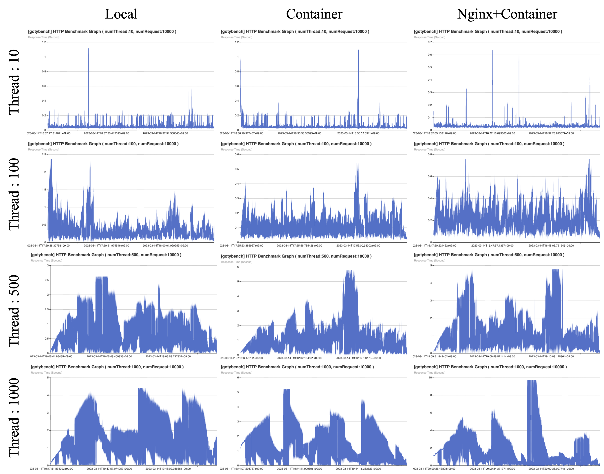
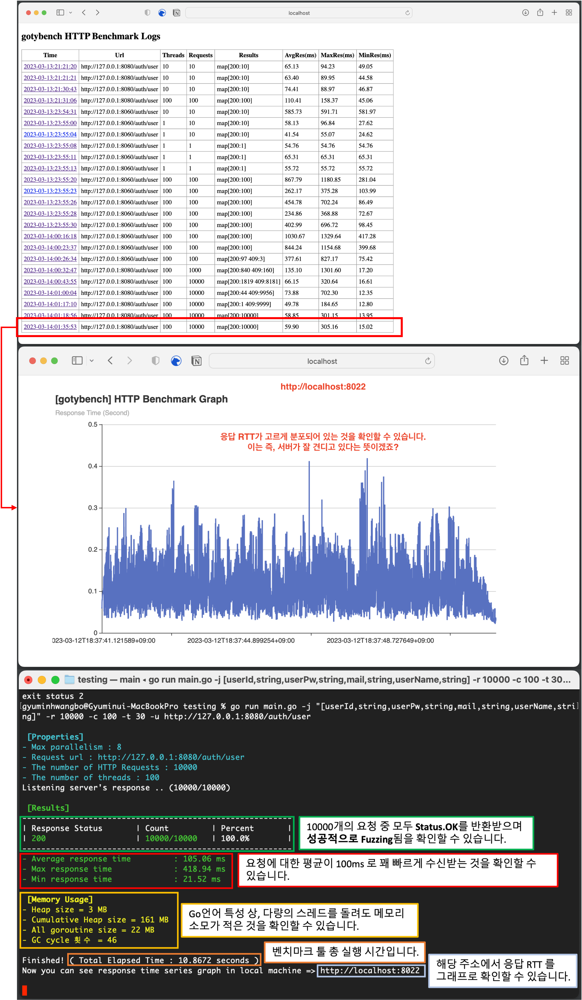

안녕하세요. 백엔드 개발자 황보규민입니다 😊

저는 **장애발생에 미리 대응**하길 좋아하며, **확장성 있는 시스템 구축**하는 것을 중점적으로 개발하길 좋아합니다.

Github : [https://github.com/ghkdqhrbals](https://github.com/ghkdqhrbals)

#### INDEX
- Introduction / Education / Skills
- Main Projects
- Toy Projects
- Activity

Introduction / Education / Skills

# Introduction

저는 장애발생에 미리 대응하길 좋아하며, 확장성 있는 시스템 구축하는 것을 중점적으로 개발하길 좋아합니다. 

따라서 저는 다음과 같이 기술을 적용한 경험이 있습니다. 

* **실시간 채팅 서버 프로젝트** (Spring-boot/Java)
  > #### 확장성 있는 시스템 구축
  > 1. MQ Kafka 를 통해 Consumer 별 오프셋을 제공함으로써 서버를 수평확장하기 쉬운 아키텍처를 구성하였습니다.
  > 2. Docker 를 통해 약 **20개**의 컨테이너를 자동으로 관리하며, 이미지 재사용성을 높이고, 환경관리를 통합하였습니다.
  > 3. API gateway 를 통해 백엔드의 통합 entry point를 제공하고, 로드밸런싱을 적용함으로써 외부에서 쉽게 접근하고 확장이 용이하도록 설계하였습니다.
  > 4. Saga 의 Orchestration 형태로 유저 서비스 기능을 구현하였습니다. 또한 이벤트 성공여부들을 클라이언트에 반환하기 위해 SSE(WebFlux) 로 전송 합니다.
  >
  > #### 장애대응
  > 1. Kafka 를 multi-broker로 설정하고 메세지들의 replica를 설정함으로써, 메세지 유실장애에 대응하였습니다.
  > 2. Debezium/JDBC-sink-connector을 통해 백업 DB를 설정함으로써, DB 유실장애에 대응하였습니다(인증DB는 AWS-RDS 백업기능으로 대체하였습니다).
  > 3. JDBC-Batch, 쿼리빈도 최적화, 로드밸런싱을 통해, 대용량 트래픽 장애에 대응하였습니다.
  > 4. 멀티스레딩 및 퓨쳐객체를 통해 DB쿼리기능(blocking), MQ 메세지 송신기능(non-blocking), 서비스 알고리즘(non-blocking + blocking)을 구현함으로써, **성능 장애에 대응**하였습니다.
  > 5. ELK 스택, Kafdrop 을 통해 Kafka 내부 및 서비스를 **모니터링**함으로써, 병목현상 원인을 파악하였습니다.
  > 6. 직접 만든 [HTTP Benchmark Tool](https://github.com/ghkdqhrbals/gotybench)를 통해 서버 부하를 측정하였습니다.
  >
  > 
  >
  > |                       | Local                                         | Container                                   | Nginx+Container                             |
  > | --------------------- | --------------------------------------------- | ------------------------------------------- | ------------------------------------------- |
  > | Request Thread : 10   | AVG:**34.28**ms, MAX:633.4ms, MIN:17.74ms     | AVG:**47.33**ms, MAX:1094.04ms, MIN:23.65ms | AVG:**47.41**ms, MAX:1110.89ms, MIN:23.23ms |
  > | Request Thread : 100  | AVG:**106.15**ms, MAX:822.36ms, MIN:18.26ms   | AVG:190.93ms, MAX:756.37ms, MIN:30.14ms     | AVG:320.01ms, MAX:2357.13ms, MIN:32.69ms    |
  > | Request Thread : 500  | AVG:**547.98**ms, MAX:2610.97ms, MIN:24.80ms  | AVG:971.29ms, MAX:5768.36ms, MIN:28.29ms    | AVG:982.68ms, MAX:4768.08ms, MIN:30.1ms     |
  > | Request Thread : 1000 | AVG:**1184.84**ms, MAX:5455.63ms, MIN:27.25ms | AVG:1550.86ms, MAX:6895.59ms, MIN:37.54ms   | AVG:1820.41ms, MAX:9866.15ms, MIN:39.19ms   |

* **뱅킹 백엔드 서버** (Gin/Golang)
  > #### 확장성 있는 시스템 구축
  > * Docker/Kubernetes 를 통해 각각의 `Pod`들의 재시작/실행을 자동화하였으며, replica 설정을 통해 쉽게 확장용이하도록 설계하였습니다.
  >
  > #### 장애대응
  > 1. AWS의 secret 저장소를 활용하여, 키 보안장애에 대응하였습니다.
  > 2. JWT 토큰과 PASETO 토큰을 인증에 사용함으로써, 서버의 세션 과부화에 대응하였습니다.
  > 3. Bcrpyt 암호화를 사용자 패스워드에 적용함으로서, DB 탈취 시 사용자의 원본 패스워드 탈취에 대응하였습니다.
  > 4. TLS 인증서를 Ingress에 적용함으로써, 패킷 탈취에 대응하였습니다.

# Education

* **부산대학교(석사)**
    * 기간 : 2020년 09월 ~ 2022년 08월 GPA: 4.25
    * 전공 : 컴퓨터공학
* **부산대학교(학사)**
    * 기간 : 2014년 03월 ~ 2020년 08월
    * 전공 : 컴퓨터공학
* **부일외국어고등학교**
    * 2010-03 ~ 2013-02

# Skill

* Backend
    * Java, Golang
    * Spring Boot, Spring Data JPA, Spring Cloud, Spring Security, Spring WebFlux, Gin
    * Junit5, Mockito, Gmock
    * Gradle
    * IntelliJ, Visual Studio Code
* DevOps
    * PostgreSQL, ELK stack
    * AWS route-53, EC2, RDS
    * Kafka, Docker
    * Linux

   

Main Projects

# Main Projects

[개발과정](https://ghkdqhrbals.github.io/portfolios/docs/project/){: .btn .btn-primary .fs-2 .mb-4 .mb-md-0 .ml-5 } [Github](https://github.com/ghkdqhrbals/spring-chatting-server){: .btn .btn-black .fs-2 .mb-4 .mb-md-0 } [설명 및 시연영상 v4.2.1](https://www.youtube.com/watch?v=3VqwZ17XyEQ&t=625s){: .btn .btn-red .fs-2 .mb-4 .mb-md-0 }
* ## 📌 **실시간 채팅 서버 프로젝트** 
  * **개요** : Kafka와 ELK stack을 통해 실시간 트래픽 관찰 및 안전성과 확장성을 고려한 Spring-Java 기반 채팅 백엔드/프론트 서버 프로젝트입니다.
    * ### **성능 최적화** 
      1. JDBC-Batch 를 통해 INSERT 네트워크 로드 및 성능을 향상시켰습니다.
      2. CompletableFuture/Flux 를 통해 멀티스레딩과 Non-blocking을 구현하여 동시성 성능을 향상시켰습니다.
      3. 이벤트 트랜젝션을 RDB가 아닌 인메모리 Redis 캐시를 통해 관리함으로써 이벤트 Read/Write 성능을 향상시켰습니다.
      4. Kafka-Batch/linger 을 통해 메세지 네트워크 전송 로드를 감소시켰습니다.
      5. postgresql 에 비활성화된 인덱싱을 활성화 및 JPA-Batch 를 통해 SELECT 성능을 향상시켰습니다.
      6. Kafka-Concurrency-Listener 을 통해 토픽 파티션 별 Consumer 을 설정하여 멀티스레드로 읽을 수 있도록 설계함으로써 성능을 향상시켰습니다.
      7. 불필요한 SQL 빈도를 낮춤으로써 성능을 향상시켰습니다.
      8. 이벤트 기반 Web Server 인 Undertow 를 사용함으로써 대용량 트래픽 처리 성능을 향상시켰습니다.
      9. 세션 DB관리 부담을 없애기 위해 Spring-Security에 JWT를 적용하였으며, 토큰의 Payload에 permission 정보를 기반으로 인가를 설정하였습니다.
      10. 성능 최적화에 필요한 HTTP Benchmark Tool 을 직접 만들어 측정하였습니다.

      결론적으로 유저저장API(인증서버 -> 고객서버 / 채팅서버 유저 저장) 성능 **110%**, 향상/채팅 저장 API(Mono) 성능 **470%** 향상되었습니다.
    
    * ### **마이크로서비스**
      1. Kafka MQ 를 통해 채팅서버 / 인증서버 / 고객서버 / 주문서버 / 물품관리서버 가 MSA Saga-Orchestration 형태로 통신하도록 구현하였습니다.
      2. 이벤트 스키마 설계를 통해 하나의 요청이 여러 서버에서 동일한 트랜젝션으로 수행되도록 구현하고 보상 이벤트 또한 구현하였습니다.
      3. Redis 캐시를 통해 빠른 이벤트 트랜젝션 관리를 수행하였습니다.
    * ### **모니터링**
      1. ELK stack 을 통해 Kafka 내부 메세지 트래픽 빈도를 그래프화 하였습니다.
      2. Kafka-drop 을 통해 Broker 상태 및 메세지를 직접 관찰할 수 있도록 설정했습니다.
    * ### **장애대응**
      1. 3대의 Kafka Broker 를 통해 Broker 가 다운되어도 다른 Broker 가 이어서 수행할 수 있도록 설계하였습니다.
      2. Eureka와 Spring-Cloud-Gateway 를 통해 별도의 Health check 없이 쉽게 확장가능하도로 설계하였습니다. 즉, 서비스가 다운되더라도 다른 동일 서비스와 자동적으로 연결됩니다.
      3. Debezium/JDBC-Sink-Connector 을 통해 백업DB를 구축함으로써 DB 장애에 대응하도록 설계하였습니다.
      4. Future Callback 을 통해 모든 기본적인 에러처리를 수행하였습니다.
    * ### **자동화**
      1. Spring-Cloud (Eureka, Gateway, Config)를 통해 서비스 통합관리를 수행하였습니다.
      2. Docker-compose 을 통해 20개의 서비스 실행순서 관리 및 자동화를 진행하였습니다.
      3. 쉘스크립트 를 통해 Kafka-Connector 설정을 자동화 하였습니다.
  * **기간** : 2022년 10월 ~ current (6개월)
  * **인원** : 1인
  * 

사용기술 펼치기

    | 사용기술 | 내용 |
    | -------- | :--- ||
    | ELK stack                    | Elastic Search + Logstash + Kibana 를 통한 통계수집/시각화 [Image](https://ghkdqhrbals.github.io/assets/img/es/5.png) |
    | Kafka                        | 3대의 Broker과 replica들을 통한 안전성 및 확장성 제공. MSA 백본망으로 사용                                                                 |
    | Debezium/JDBC-Sink-connector | Kafka를 통한 백업 DB uni-directional sync [Details](https://ghkdqhrbals.github.io/posts/chatting(9)/)                 |
    | Docker                       | 서버/DB/Kafka/Connector/ELK/Monitoring/etc. 실행 자동화                                                               |
    | Nginx/Spring-Cloud-gateway   | API gateway로써 채팅서버 및 인증서버를 묶어서 통합 RestApi entry point 제공                                           |
    | Stomp                        | 채팅 실시간성 제공                                                                                                    |
    | JPA + JDBC                   | INSERT 문 JDBC 배치 프로세싱, 비동기 DB 관리                                                                          |
    | AWS RDS                      | authDB에 적용되었으며, Postgresql 성능지표 시각화                                                                     |
    | Spring-Security              | Reactor 기반 JWT 인증 및 유저 Role 별 인가 설정                                                                     |
    | Spring-Cloud                 | Eureka 및 Config-Server 설정으로 자동 yaml 배포 및 확장성 고려                                                                |

    

    

  * 

아키텍처

    
    

    

    

    
      
  * 

시각화된 자료 펼치기

    
    
    
    

    

[Github](https://github.com/ghkdqhrbals/golang-backend-master){: .btn .btn-black .fs-2 .mb-4 .mb-md-0 .ml-5} 
* ## 📌 **뱅킹 백엔드 서버** 
  * **개요** : Gin-Golang 기반 뱅킹 RestAPI 백엔드 서버입니다
    * ### **배포 자동화**
      1. GitActions로 AWS-ECR에 도커 이미지를 저장하는 CI/CD 파이프라인을 구축하였습니다.
      2. AWS-IAM/EKS 을 통해 자동적으로 ECR에서 이미지EKS에서 컨테이너를 확장할 수 있도록 구현하였습니다.
      3. Sqlc 을 통해 Spring-Data-JPA 처럼 인터페이스를 자동적으로 생성하도록 구현하였습니다.
      4. Docker-compose 를 통해 Local에서도의 개발을 자동화하였습니다.
    * ### **서버 리소스 최적화**
      1. JWT 토큰과 PASETO 토큰을 통해 서버의 세션유지 및 인증에 소모되는 리소스를 감소시켰습니다.
      2. AWS-EKS Ingress 서비스의 Nginx 에 Round-robin를 기반으로 LoadBalancing을 적용하여 서비스의 부하를 분산시켰습니다.
       
  * **기간** : 2022.06 ~ 2022.09 (4개월)
  * **인원** : 1인
  * 

사용기술 펼치기

    | 사용기술   | 내용                                                                                                                                                         |
    | :--------- | :----------------------------------------------------------------------------------------------------------------------------------------------------------- |
    | AWS        | Git-workflow와 ECR/EKS/Route-53/IAM/secret-manager/RDS를 연동하여 CI/CD 파이프라인 구축 [Image](https://ghkdqhrbals.github.io/assets/img/golang/deploy.jpeg) |
    | JWT        | 인증토큰으로 세션유지 리소스 최적화                                                                                                                          |
    | Bcrypt     | HASH(password + salt) 로 안전한 DB 저장 [Image](https://ghkdqhrbals.github.io/assets/img/golang/safe-password-storing.jpeg)                                  |
    | Sqlc       | sql문 인터페이스화                                                                                                                                           |
    | Docker/K8S | 서버+DB CI                                                                                                                                                   |
    | Gin        | RestApi 구현 [Details](https://github.com/ghkdqhrbals/golang-backend-master/wiki/ghkdqhrbals:gin)                                                            |
    | Viper      | 외부 configuration 의존성 주입 [Details](https://github.com/ghkdqhrbals/golang-backend-master/wiki/ghkdqhrbals:viper)                                        |
    | Gmock      | mock test [Details](https://github.com/ghkdqhrbals/golang-backend-master/wiki/ghkdqhrbals:mockdb)                                                            |

    

    

    

[개요확인](https://ghkdqhrbals.github.io/portfolios/docs/Blockchain/){: .btn .btn-primary .fs-2 .mb-4 .mb-md-0 .ml-5 } [논문확인](https://scienceon.kisti.re.kr/srch/selectPORSrchArticleOrgnl.do?cn=DIKO0016457502){: .btn .btn-blue .fs-2 .mb-4 .mb-md-0 .ml-5} [소개영상](https://www.youtube.com/watch?v=HbAPQwbNtfw){: .btn .btn-red .fs-2 .mb-4 .mb-md-0 }
* ## 📌 **다중 Geth 취약점을 이용한 블록체인 이클립스 공격 설계** 
  * **개요** : Golang으로 제작된 이더리움 클라이언트(~1.9.25v)를 마비시키는 공격설계 논문입니다
    * ### **모니터링**
      공격받는 노드의 현재 리소스 소모 상태를 하트비트를 통해 확인할 수 있도록 설계하였습니다. 또한 이를 이용하여 공격 패킷의 개수를 최적화 하였습니다.
    * ### **성능개선**
      공격 패킷을 미리 생성함으로써 초당 전송할 수 있는 패킷개수를 **210% 증가**시킬 수 있었습니다.
    * ### **IP spoofing**
      UDP 패킷 내 소스 주소 및 포트를 랜덤하게 설정하여 희생자가 공격을 알아채지 못하도록 설정하였습니다.
  * **기간** : 2020.09 ~ 2022.08 (2년)
  * **인원** : 3인(1저자)
  * 

사용기술 펼치기

    | 사용기술          | 내용                                                                                                                                                                             |
    | :---------------- | :------------------------------------------------------------------------------------------------------------------------------------------------------------------------------- |
    | DDoS              | UDP-based 분산 DoS 공격을 통한 노드의 연산 자원을 강제로 소모되도록 유도                                                                                                         |
    | Ethereum-analysis | 이더리움 Geth 클라이언트의 라우팅 테이블 + 패킷 분석을 통한 내부구조 확인                                                                                                        |
    | IP 변환           | UDP-based DoS공격 + IP 변환을 통해 희생자 노드의 공격방어율 하락 유도                                                                                                            |
    | HeartBeat         | 희생자 노드의 HeartBeat 관측을 통해 공격 패킷개수 최적화                                                                                                                         |
    | Kademlia DHT      | 해당 테이블은 P2P상에서 연결하고자 하는 노드들을 저장하는 라우팅 테이블. 본 공격은 이를 드롭                                                                                     |
    | Eclipse Attack    | 노드 고립 유도하여 블록 동기화 과정 진입 억제 [추가논문확인](https://ghkdqhrbals.github.io/assets/img/EthereumEclipseAttackAnalysis.pdf){: .btn .btn-blue .fs-2 .mb-4 .mb-md-0 } |

    

    

  * 

아키텍처 펼치기

  
    
    

    

    

Toy Projects

# Toy Projects

[개발과정](https://ghkdqhrbals.github.io/portfolios/docs/project/2023-01-15-chatting(11)/){: .btn .btn-primary .fs-2 .mb-4 .mb-md-0 .mr-2 .ml-5} [Github](https://github.com/ghkdqhrbals/gotybench){: .btn .btn-black .fs-2 .mb-4 .mb-md-0 } [설명 및 시연영상](https://www.youtube.com/watch?v=cV3ILCrfsco){: .btn .btn-red .fs-2 .mb-4 .mb-md-0 }
* ## 📌 **HTTP Benchmark Tool 개발**
  
  * **개요** : Golang, net/http 기반 다량의 HTTP를 전송하여 서버를 테스트할 수 있는 시뮬레이터입니다.
    * ### **동시성 고려**
      1. goroutine 경량 멀티 스레드를 사용하였으며, 채널을 통해 통신하도록 설정하였습니다. 본 테스트는 많은 수의 스레드를 돌리기에 Thread-safe 하게 설계해야합니다. 그래서 응답결과분석을 단일 스레드로 돌리고, 채널을 통해 다른 스레드로부터의 응답을 가져와서 스레드 stack 에서 처리할 수 있도록 설계함으로써 성능과 안전성을 향상시켰습니다.
    * ### **사용자 편의성 고려**
      1. flag 를 사용하여 사용자 편의성을 증가시켰습니다.
      2. Dynamic-Struct를 통해 Fuzzing 하고자 하는 Json 오브젝트를 자동적으로 생성할 수 있도록 설계하였습니다.
      3. 테스트 기록을 확인할 수 있도록 로그 서버를 제공함으로써 사용자 편의성을 증가시켰습니다.
      4. uilive, graphing, fatih 를 통해 평균응답/최대응답/최소응답 Rate 및 시간에 따른 응답속도를 그래프화하여 한눈에 보기 편하도록 구현하였습니다.
  * **기간** : 2023.01 ~ 2023.03
  * **인원** : 1인
  
  * 

사용기술 펼치기

    | 사용기술 | 내용 |
    | -------- | :--- ||
    | Docker            | 환경설정 및 빌드&테스트 자동화                                  |
    | Viper             | 외부 configuration 의존성 주입                                  |
    | Dynamic structure | 오브젝트 필드 Dynamic 생성                                      |
    | Multi-threading   | 경량 고루틴 스레드 생성 및 스레드간 채널생성을 통해 동시성 증가 |
    | net/http          | 벤치마크 툴 클라이언트의 http 통신 설정                         |

    

    

    
  * 

테스트 결과 펼치기

    

    

    

[Github](https://github.com/ghkdqhrbals/blockchain-with-python){: .btn .btn-black .fs-2 .mb-4 .mb-md-0 .ml-5}
* ## 📌 **블록체인 기반 친환경 에너지 거래 플랫폼 프로토타입** 
  * **개요** : python으로 제작된 블록체인 기반 친환경 에너지 거래 플랫폼의 프로토타입입니다. 합의 알고리즘에 집중하였습니다.
    * ### **새로운 합의 알고리즘 설계**
      REC의 쌍방계약 형태에 맞춰 블록체인 트랜잭션을 이중서명 구조로 새롭게 제안합니다.
  * **기간** : 2021.03 ~ 2021.06
  * **인원** : 2인(팀원)
  * 

사용기술 펼치기

    | 사용기술         | 내용                                                                                                                                                                   |
    | :--------------- | :--------------------------------------------------------------------------------------------------------------------------------------------------------------------- |
    | 블록 생성자 결정 | 동기화된 네트워크에서 랜덤한 생성자를 결정할 수 있는 알고리즘 제작 = `𝑀𝑖𝑛𝑒𝑟=𝑀𝑎𝑥_𝐴𝑑𝑑𝑟 (ℎ𝑎𝑠ℎ(𝑃𝑟𝑒𝑣𝐵𝑙𝑜𝑐𝑘𝐻𝑎𝑠ℎ,𝐴𝑑𝑑𝑟)` `𝑀𝑎𝑥_𝐴𝑑𝑑𝑟`값이 가장 큰 노드가 블록 생성자로 결정됩니다 |
    | 블록 완결        | 합의에 의한 Block confirmation `∑(0<𝑖<𝑑)𝑅𝐸100_𝑖^𝑎𝑔𝑟𝑒𝑒 ≥2/3 𝑅𝐸100_𝑡𝑜𝑡𝑎𝑙` (PBFT와 동일)                                                                                  |

    

    

[개발과정](https://ghkdqhrbals.github.io/portfolios/docs/기타/toyp2/){: .btn .btn-primary .fs-2 .mb-4 .mb-md-0 .ml-5 } [Github](https://github.com/ghkdqhrbals/Malware_LSTM){: .btn .btn-black .fs-2 .mb-4 .mb-md-0 .ml-5}
* 📌 **빈도수 모델을 통한 악성 파워쉘 스크립트 탐지**
  * **개요** : python으로 제작된 Fileless Malware 중 파워쉘 스크립트 탐지 툴입니다.
    * #### 탐지 유연성 개선
      LSTM 와 TF/IDF 의 앙상블을 통해 기존 스태틱 탐지에 유연성을 더하였습니다.
    * #### 비난독화 고려
      난독화된 악성코드를 분석하는 것은 오히려 성능에 악영향을 미칩니다. 따라서 저희는 Revoke Expression으로 난독화 정도를 파악한 뒤, Power Decoder을 통해 다양한 방법으로 비난독화를 진행하였습니다. 
  * **기간** : 2021.09 ~ 2021.12
  * **인원** : 3인(팀장)
  * 

사용기술 펼치기

    | 사용기술                    | 내용                                                                                                                                                                      |
    | :-------------------------- | :------------------------------------------------------------------------------------------------------------------------------------------------------------------------ |
    | Pattern Analysis            | Fileless Malware 의 특성인 메모리 상 동작하는 악성 스크립트의 패턴을 분석                                                                                                 |
    | Powershell Malware Analysis | 악성 파워쉘 스크립트의 패턴을 분석 [논문 분석 자료](https://ghkdqhrbals.github.io/assets/img/golang/study-powershell-malware.pdf){: .btn .btn-blue .fs-2 .mb-4 .mb-md-0 } |
    | 비난독화                    | 난독화 된 악성 스크립트를 탐지를 위해 비난독화 진행(base64-encoding + etc.)                                                                                               |
    | TF-IDF                      | 빈도수 기반 모델 사용                                                                                                                                                     |

    

    

  * 

아키텍처 펼치기

    
    

    

  

  
  

Activity

# Activity

| 날짜                         | 분류       | 내용                                                                                                                                                                                                         |
|----------------------------|----------|------------------------------------------------------------------------------------------------------------------------------------------------------------------------------------------------------------|
| 2022년 01월 ~ 2022년 12월  | 특허 출원    | 블록체인 클라이언트 취약점 탐지 방법 및 취약점 탐지 장치                                                                                                                                                                           |
| 2021년 12월  | 학술대회 참여  | [N-gram과 위협 행위 기반의 Windows 악성코드 패밀리 주요 유형 패턴 분석](http://rs2.riss4u.net/search/detail/DetailView.do?p_mat_type=1a0202e37d52c72d&control_no=47f3a8517a86ee8f7f7a54760bb41745&keyword=황보규민)                   |
| 2021년 09월 ~  2021년 11월 | SW 등록    | RE100(알이100) 실현을 위한 블록체인 기반 REC(신재생에너지공급인증서) 거래 플랫폼 프로토타입 [C-2021-044149](https://www.ntis.go.kr/outcomes/popup/srchTotlSpwr.do?cmd=view&rstId=SNW-2021-00312106034&returnURI=null&pageCode=RI_SW_RST_DTL) |
| 2021년 09월 ~  2021년 11월 | 대회참여     | Convergence Security Graduate School Hackathon Competition                                                                                                                                                 |
| 2021년 09월 ~  2021년 12월 | 대회참여(4등) | 2021 Cybersecurity AI/big data challenge, Korea Internet & Security Agency(KISA) - 파일리스 악성코드탐지 부문                                                                                                          |
| 2020년 09월 ~  2020년 12월 | 대회참여(3등) | 2020 K-cyber security challenge, Korea Internet & Security Agency(KISA) - 개인정보보호 부문                                                                                                                        |
| 2019년 06월 ~  2019년 9월  | 교환학생     | Summer education program in San Jose State Univ. 1 Washinton Square, CA, USA                                                                                                                               |
| 2017년 12월 ~  2018년 3월  | 교환학생     | Winter education program in HELP Univ. Bukit Damansara 50490 Kuala Lumpur, Malaysia                                                                                                                        |

